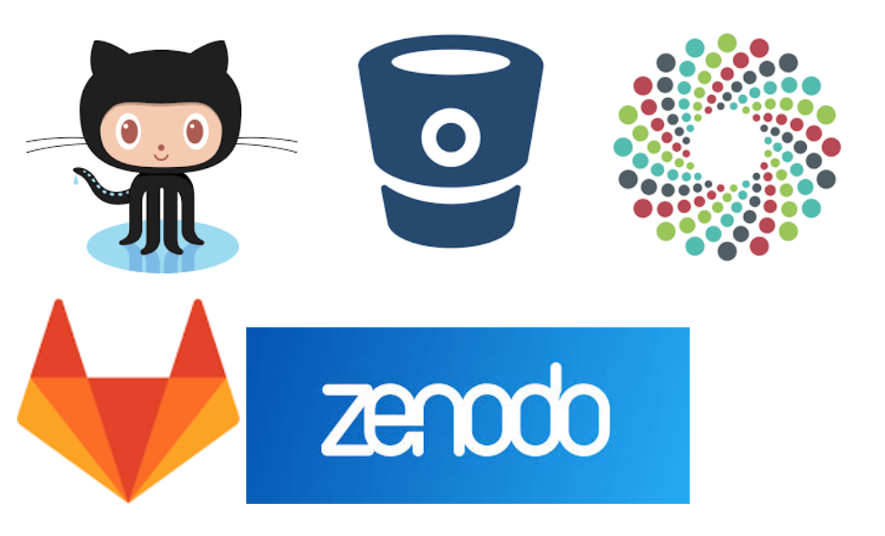

### Collaborations Workshop 2018 - 2018-03-26

Group K - CI2-CW18 

#### AutoSoftCat

### **Reporter**

Dave McKain - [davemckain@gmail.com](mailto:davemckain@gmail.com)

### **Participants**

_Alys Brett - alys.brett@ukaea.uk_

_[Alexander.Struck@hu-berlin.de](mailto:Alexander.Struck@hu-berlin.de)_

_Caroline Jay caroline.jay@manchester.ac.uk_

---

### **Context / Research Domain**

Discoverability of software for potential reuse or collaboration is an issue that is common across research domains.

### **Problem**

Software is hard to find. If published at all, software is located in many places, which varies according to the underlying discipline or domain. Some of these are neither open to the public nor provide an API. Existing approaches to list all research software repositories are incomplete, have questionable indexing, are hardly known, e.g. [http://re3data.org](http://re3data.org), or arguably doomed to fail under the weight of their ambitions.

Traditionally, visibility (at least within a specific domain) has been pursued via research networks, through publications, conferences and word of mouth. 

### **Solution**

With the increasing use of software repositories that provide API access, and the moves towards definition of metadata standards for software, the possibility to create automated or partially automated catalogues is becoming viable. 

This is not an attempt to create the “one catalogue to end all catalogues” but to make it easy for people to create a catalogue for the particular subset of research software of interest in their community, regardless of which repository it resides in. 

Ultimately: tool that uses API and code metadata to support the generation of federated catalogs obtained from interrogating one or more sources. Ideally just the existing repository metadata should result in a basic catalogue entry but there should be the ability to improve it by adding extra metadata such as a logo or named contact (eg using a standard format)

In the hack day: Do a survey of existing relevant repositories and APIs they provide, metadata schemes they support and probably other features.

### **Diagrams / Illustrations**

_Example repositories and software applications_

### DO NOT PRINT == Random discussion notes

Reusing tools?

How to find out about tools from other places? Often via informal, conferences, workshops. 

Possibly resistance to talk about tools rather than results at conferences.

Software catalogues is a known problem.

Can we generate this from metadata in repositories?

What’s the right metadata format? CodeMeta?

Addressing findability can help address reusability?

Can we rely on Github et al always being there? We should be mirroring / distributing code in various places.

There are already discipline-specific examples - one in astrophysics that nobody can remember the name of at present :-)

Is it OK to be domain specific?

Balance “want to make software reusable” vs. “made to put software online because you were told to do it”

There is a layer above many research data/software repositories. [http://re3data.org](http://re3data.org) but is this the way to go?

Which repository platforms provide an API to interrogate the metadata therein?

Need to be clear about separating platform (e.g. Gitlab) vs. instance of a platform (e.g. gitlab.com, internal gitlab…)

What does software really need to do to become discoverable?

We’d be looking to make it possible for people to harvest & federate metadata from a selection of repositories of their choice, rather than trying

to come up with a single catalogue of Everything.

Good to have a concrete example: Alys has something on fusion that we can use?

Eg 

PITCH: Do a survey of known software repositories and gather information about API availability for automatic harvesting purposes into a central catalog.

Requirements and analysis for an automatic catalogue building tool (think CodeMeta implementation)

APIs to search for:

OAI-PMH

REST API

List of repository software and locations?

Github

Gitlab

Bitbucket

DataCite

Zenodo

Figshare

DSpace as a local repository software?
