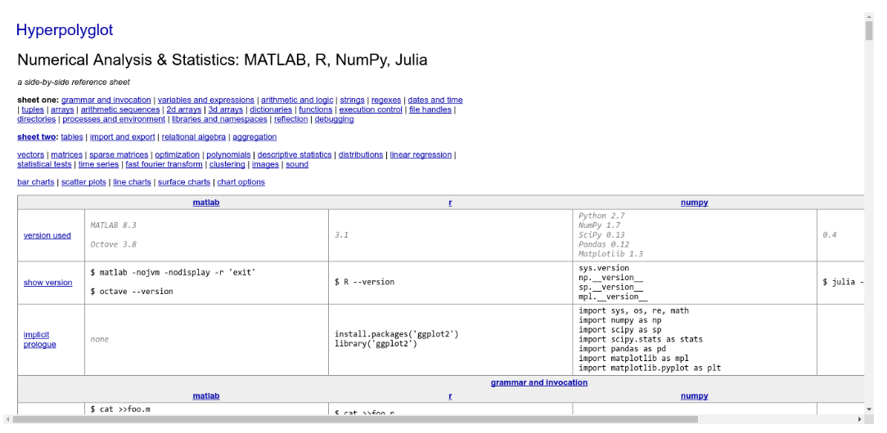
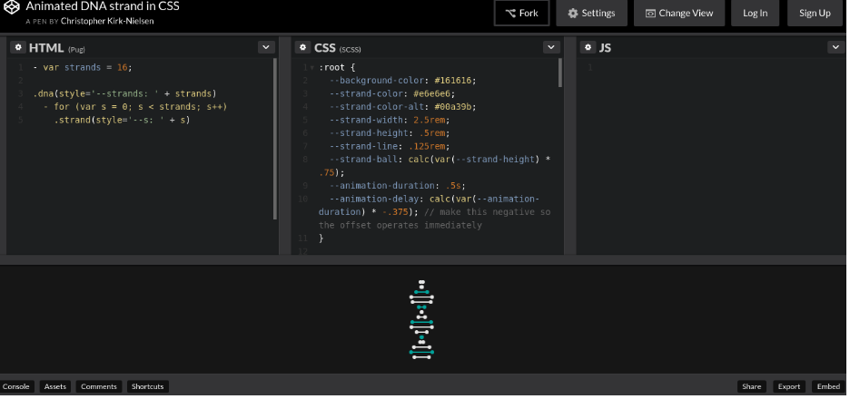

### Collaborations Workshop 2018 - 2018-03-26

Glotly Live - InterLang - CI7-CW18

### **Reporter**

Raquel Alegre - raquel.alegre@gmail.com

### **Participants**

Reed Milewicz; Ann Gledson; Alexander Morley; Raquel Alegre; Mike Jackson

---

### **Context / Research Domain**

Research Software; Training

### **Problem**

Within the context of research software engineering tasks, researchers and developers must engage with many different languages and technologies. A common frustration is that developers find themselves needing to express the same concepts in code using different idioms in different languages, either when learning a new language for the first time or when revisiting a language they have not used for a while. While this information can be found through many different sources, but it’s not always convenient or easy to do so.

### **Solution**

We propose a tool to interactively explore the similarities and differences between how you can accomplish the same task in different languages in a single place. The idea is based off of “Hyperpolyglot”, a website that statically compares the syntax for common operations between different languages ([http://hyperpolyglot.org](http://hyperpolyglot.org)). The value-added would be that this tool would provide a degree of interaction and on-demand execution. For example:

1. The tool offers a section showing how to add two lists of numbers in various languages.
2. The user can enter values for the two lists.
3. The tool shows how the lists can be defined in each language, how the two lists can be added and, optionally, the result of the execution.

For functions with arguments that control behaviour, these could be experimented with too,

### **Diagrams / Illustrations**

CC-BY-SA 

