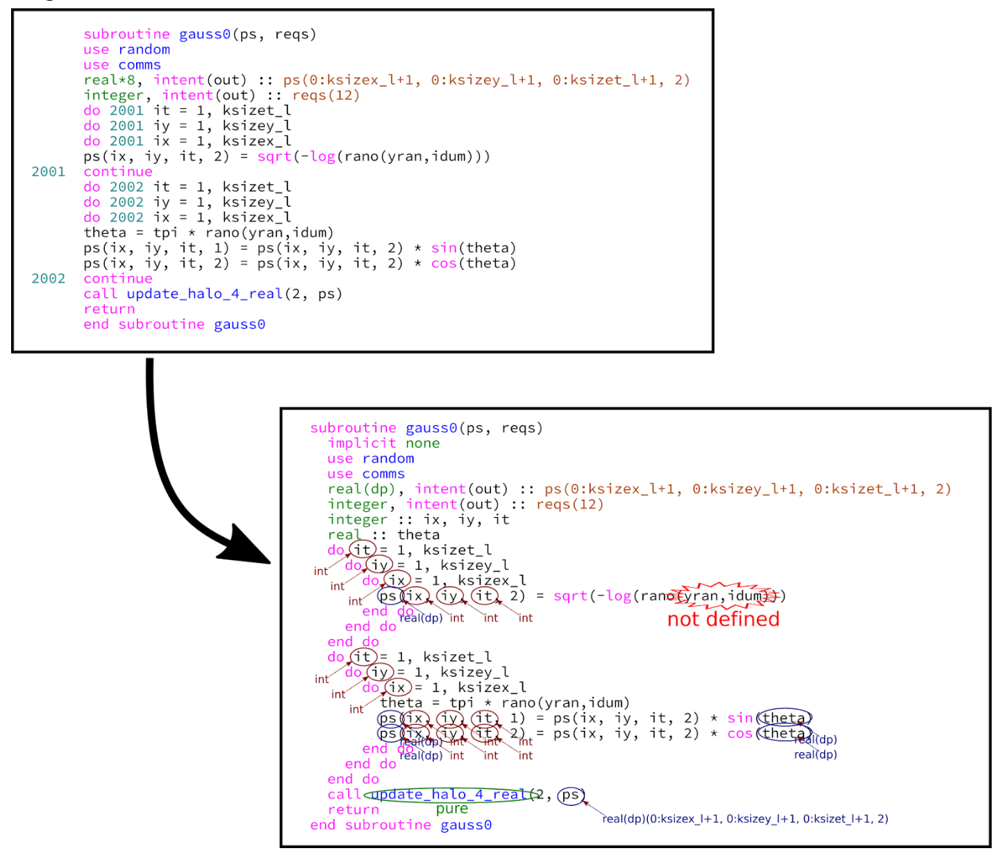

### Collaborations Workshop 2018 - 2018-03-26

iFortran Linter - Group E - CI9-CW18

### **Reporter**

Mark Turner - mail@markdturner.co.uk

### **Participants**

Sammie Buzzard, Nikoleta E Glynatsi, Mark Turner, Ed Bennett, Stephen Crouch

---

### **Context / Research Domain**

iFortran does not have useful linting tools and could benefit from syntax highlighting, colour coding and comments and help guides for specific functions and variables.

### **Problem**

Have you ever tried to understand, translate, or even refactor Fortran code? Unfortunately, as researchers we’ve all come across the issue at least once. We don’t have time to learn Fortran fluently so what if there was a tool which could make our work easier? The problem is compounded by the lack of linting tools for iFortran.

### **Solution**

Our proposed solution is an annotator and syntax highlighter for Fortran problems: a high-level source code hinter to analyse and identify real and potential problems with Fortran code, particularly legacy iFortran code. By inserting hints as comments into the code source (using a traffic light colour-coded system - red for solve now, amber for warning), it can help users perhaps first starting out with Fortran to consider which aspects of the code need attention. Importantly, it could also identify implicit variable types by variable name (due to Fortran's type conventions) and insert explicit type declarations for these variables into the code.

### **Diagrams / Illustrations**

