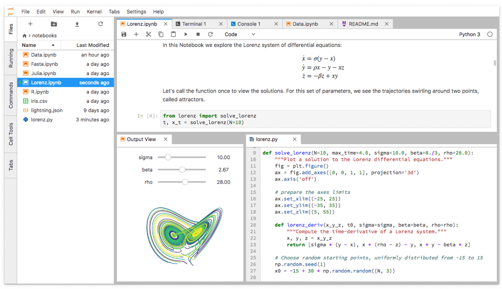
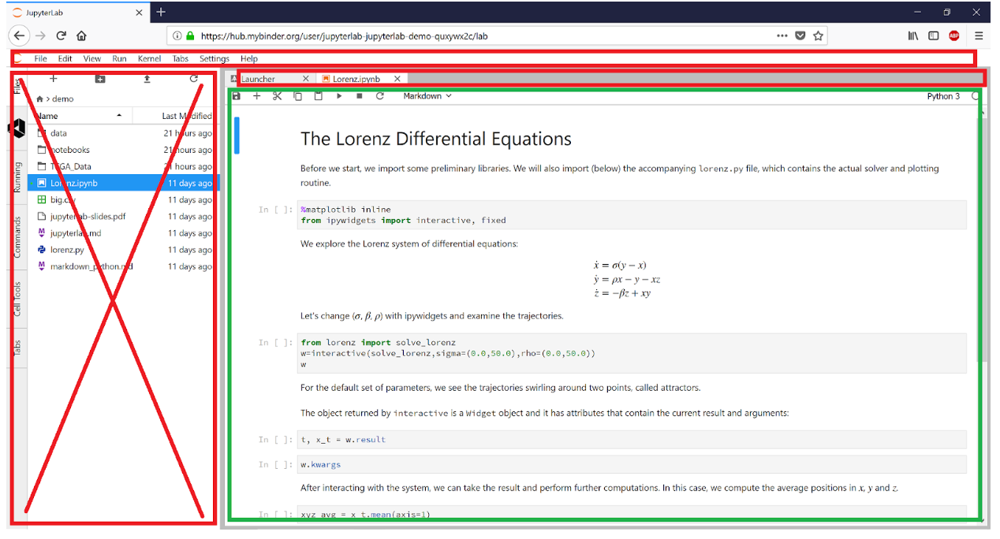

### Collaborations Workshop 2018 - 2018-03-26

Streamlining JupyterLab as a teaching tool

### **Reporter**

Tania R Allard - t.allard@sheffield.ac.uk

### **Participants**

_Tania Allard, Matt Williams, Mark Dawson, Jeremy Cohen, Sam Mangham, Robin Long_

---

### **Context / Research Domain**

The problem covers the domain of training and education for new users of interpreted languages. 

### **Problem**

Existing tools to support training are either too simplistic, resulting in a steep learning curve for students who need to install complex environments and understand packaging systems or command-line REPL interfaces, or too complex, aiming to streamline the user experience to a level that presents too many choices and provides a cluttered interface. We consider JupyterLab ([https://github.com/jupyterlab/jupyterlab](https://github.com/jupyterlab/jupyterlab)) to be one such tool. While JupyterLab provides students with access to all the functions and tools that they can make use of to learn an interpreted language, this results in a complex and confusing environment for beginners. This idea sets out to address the challenges that beginners face when being taught via JupyterLab, offering a streamlined experience while capitalising on the benefits of the powerful environment that the system provides.

### **Solution**

We propose to build a tool which simplifies the use of JupyterLab as a teaching tool. This would simplify the user experience, by automating setup of their environment and views.

This would include generating a JupyterLab extension that allows for the use of pre-created UI templates. Also, a standard tool to set up the teaching materials for each set of exercises based on, perhaps, a standard Git repo layout which can be moved through automatically, putting the files for the lesson in the right place and ensuring that students can always be in the right directory. This would allow to automatically make relevant elements visible on the page (CSV files, Python modules, images) for each lesson, selectable by the user.

### **Diagrams / Illustrati**ons

An example of the JupyterLab instance running in the browser. For teaching purposes it would be helpful to remove UI elements which would be distracting  - essentially allowing the instructor to create a fixed interface, or choose from a selection of fixed interfaces that limit the options to those needed for the given tutorial. The simplest view would be to remove the bar at the left, fix the interface to only display one single notebook view and remove the ability to close the tab.

For the next class you might be using the command line as well and so a fixed interface with two panes, with the file you want already open in one and a terminal in the right directory in the other. 

In both cases, removing most of the menu bar items at the top except for a single “continue to next section/exercise” item. This would allow you to easily have the students flow between pre-arranged setups for each exercise, removing the need for students to learn to navigate between file directories too and further streamlining the working environment.
