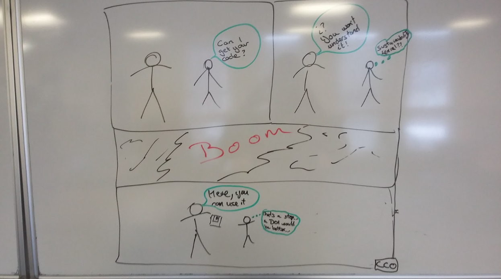

### Collaborations Workshop 2018 - 2018-03-26

Group B Collab idea - CI4-CW18

### **Reporter**

Martin Callaghan - callaghanmt@gmail.com

### **Participants**

Alice Harpole - University of Southampton

Martin Callaghan - University of Leeds

Catherine Jones - STFC

Daniel Grose - Lancaster University

David Pérez-Suárez - University College London

---

### **Context / Research Domain**

We all (seem) to share similar perspectives on what tools and techniques make for sustainable and effective software. However, not everyone shares these perspectives. Many communities and individuals are still **sustainability** **deniers**. They don’t see the need to apply these principles and especially how it can change their communities and their codes.

### **Problem**

Rather than many people all answering the same questions, we can work together and crowdsource to provide some standard responses and examples.

### **Solution**

***Sustainability Deniers - I am not doing it because….*** The resource which enables you to respond to common statements  with common wording.

This could take the form of a website (webcomic??) with a list of common excuses for not implementing software sustainability practices, and a set of persuasive arguments and solutions to encourage deniers to change their ways.

We would brainstorm the most common questions around open software and potential answers.

### **Diagrams / Illustrations**

