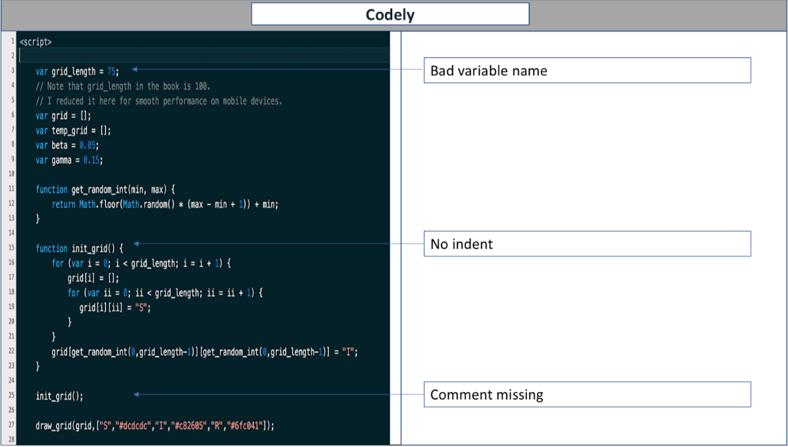

### Collaborations Workshop 2018 - 2018-03-26

Group D - Collaborative Ideas - CI12-CW18

### **Reporter**

Neil Chue Hong - n.chuehong@googlemail.com

### **Participants**

Geraint Palmer

Eike Muller

Diana Suleimenova

Becky Arnold

Kenneth Hansen

Neil Chue Hong

Initial ideas: 

* Giving instantaneous feedback to students on the quality of their programming
* Updating f2py to work with Python 3 (this may already be done in numpy)
* Py2f to call python from Fortran
* Visualising your data in many common visualisations to help you choose the right one
* Improving Diana’s visualisations of refugee migration simulations

### **Context / Research Domain**

Teaching programming to researchers across all research domains. And for self-learning.

### **Problem**

When teaching programming to large classes of computational researchers, an issue is that the small amount of direct contact time each week is used trying to solve basic programming problems (such as things not compiling or poor programming practices). Also, students often write large chunks of code and only check the correctness of the overall program, which makes debugging very hard.

We’d like to give students instantaneous feedback that would enable them to make progress with their work through the week when they are not with the teacher. This would encourage students to write code in small stages, and encourage them not to be afraid to fail and encourage experimentation through test-driven development.

Also having feedback on style of code from the start (e.g. report tells you to avoid duplicated code, suggests re-writing as a function) can encourage good habits from very early in a student’s coding education.

### **Solution**

There are two things that we could tackle here:

* Give them assistance in checking things that run, and guidance on interpreting error languages
    * But this is easier to check for interpretative languages
* Give them feedback on style and other programming practices that can be automatically checked
    * This is easier to make language independent, but harder to check actual quality
    * Could check for things like duplicated code, lack or too many comments, poor variable names etc. 

Want to do this as a website where you could upload code snippets (of order of 100 lines of code) and select the language and it would check your code.

This could be presented split screen - on the left is the code window, on the right is a report on the errors / warnings like in plagiarism detection, maybe with highlighting the lines with issues, or underline problems like a grammar checker? 

### **Diagrams / Illustrations**

