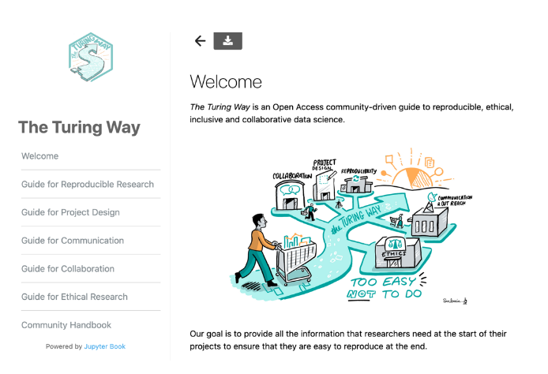
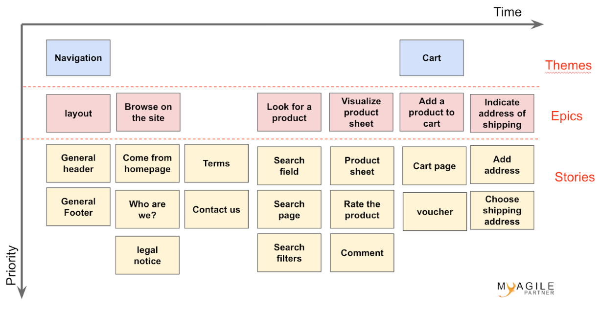
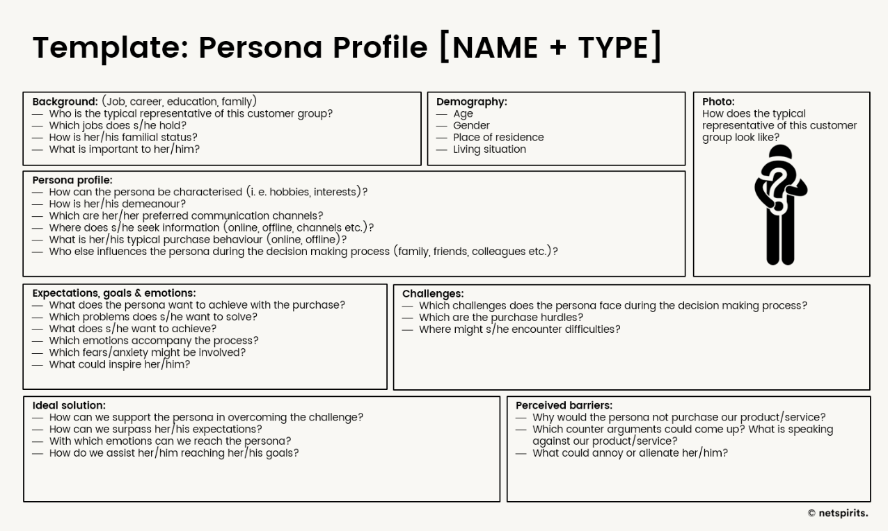

### 2CW20 - 2020-03-31 to 2020-04-02

Epsilon - Equitable Collaboration guide for distributed/online teams and communities in The Turing Way - HP5-CW20

### **Hackday Idea Proposer: _The Turing Way Community Members_ **

---

**Overview: **

_There are three pitches (idea 2, idea 5 and idea 8) that can be used as a combined solution to this pitch (see below)._

**Context / Research Domain**

Remote collaboration has gained popularity over the last years as more and more companies expand their business in areas far from the location of the main office (for example,[ Mozilla](https://www.mozilla.org/en-GB/)), or exist entirely as a remote company (for example,[ RStudio](https://rstudio.com/about/)). In early 2020, as we began to work entirely from home due to[ Coronavirus (COVID-19) pandemic](https://www.who.int/emergencies/diseases/novel-coronavirus-2019), we experienced a drastic change in our work culture without much support or training. 

Working remotely is challenging for many people for several reasons, including the carer’s responsibilities, insufficient or unsuitable home conditions for work, and other mental and health-related burdens. However, it is also a favorable time for people who want to lead a project online by inviting individuals to work on medical/non-medical solutions or software that can take on challenges related to the coronavirus pandemic situation in their communities.

**Problem**

Since online platforms provide equitable opportunity for anyone to collaborate with others over the internet, often such collaboration can go wrong if the goals and expectations from the collaboration are not clearly defined. There is also an assumption that everyone will have similarly suitable situations to work effectively from home.

As we continue to work remotely for a foreseeable future, we know that there is a pressing need for guidelines and learning resources for people who do not have any prior experience or support in making their online communication and collaboration in a project effective.

We have started to develop chapters in The Turing Way on remote and distributed collaboration ([see here](https://deploy-preview-962--the-turing-way.netlify.com/remote_collaboration/remote_collaboration.html)). However, it is lacking multiple perspectives from a wider research community that the attendees of the Collaboration Workshop 2020 can fill. 

We propose to cover the following aspects of online and remote collaboration:

* Establishing initial protocols to ensure a welcoming environment
* Managing communication and project resources
* Choice of tools to ensure their accessibility, safety, and data security
* Establishing functional and effective leadership
* Ensuring well being of team and community members
* Collecting stories and impact studies that are relatable

A couple of sections that are already written; regarding the perceived pros and cons of distributed collaborative setting and checklists for organizing and participating in online meetings and events; require review from other experienced researchers who could fill the gaps by adding the missing information.

### **Solution**

There are already three teams who have proposed the following ideas:

* Idea 5 - Remote Conferences and Collaboration: The Turing Way - CI5-CW20
* Idea 8 - Online Community Cookie Cutter c3 - CI8-CW20
* Idea 2 - Conferencing 3.0: ensuring equality for in-person and online participants - CI2-CW20
* See also the ‘Message in e bottle’ idea

These topics aim to create accessible resources for researchers to make their online collaboration and communication easier and effective by providing low barrier guides._ _In this pitch, we propose to support these teams in hosting their contributions to _The Turing Way _to ensure higher visibility and sustainability! 

See this GitHub Issue for details: [https://github.com/alan-turing-institute/the-turing-way/issues/960](https://github.com/alan-turing-institute/the-turing-way/issues/960) 

### **Diagrams / Illustrations**

**Notes from the main discussion:**

**Main Room 1: for the report out **

* **Hybrid conferences aspects (Room 8)**
    * Patricia (doesn’t have a clue but would love to read up and learn/discuss)
    * Neil
    * Mateusz
    * Jez
    * Bezaye
    * **References:**
        * Somewhat useful reference (checklist for hybrid and online): [https://deploy-preview-962--the-turing-way.netlify.com/remote_collaboration/checklist/checklist.html](https://deploy-preview-962--the-turing-way.netlify.com/remote_collaboration/checklist/checklist.html)
        * Example: [gallantries](https://galaxy-carpentries.github.io/gallantries/about)
* **Persona and pathways (Room 8)**
    * Neil
    * Malvika
    * Emily
    * Emmy
    * **References:**
        * For inspiration: [https://www.justinmind.com/blog/user-persona-templates/](https://www.justinmind.com/blog/user-persona-templates/)
        * Persona and pathways (Mozilla): [https://mozillascience.github.io/working-open-workshop/personas_pathways/](https://mozillascience.github.io/working-open-workshop/personas_pathways/) 
        * Here’s one from innovation Leaders: [https://docs.google.com/presentation/d/1Yx8Xl-KRJCfy1hz0YeBrp7OD-UK8CSF3LNxplw3Yj20/edit#slide=id.g7e0097e685_0_0](https://docs.google.com/presentation/d/1Yx8Xl-KRJCfy1hz0YeBrp7OD-UK8CSF3LNxplw3Yj20/edit#slide=id.g7e0097e685_0_0)
        * And a story mapping guide: [https://www.thoughtworks.com/insights/blog/story-mapping-visual-way-building-product-backlog](https://www.thoughtworks.com/insights/blog/story-mapping-visual-way-building-product-backlog)
* **Templating materials (Room 11)**
    * Ben
    * Sarah
    * Stephan
    * Frances
    * Jo
    * **References:** 
        * Here's one of the canvases for fun activities we've been playing with [https://docs.google.com/presentation/d/1i3WlLHKHV7L7D94LM43znokhHTU15Y0hEZSy-EiLTTM/edit?usp=sharing](https://docs.google.com/presentation/d/1i3WlLHKHV7L7D94LM43znokhHTU15Y0hEZSy-EiLTTM/edit?usp=sharing)
        * guide with a basic overview: [http://www.dcc.ac.uk/sites/default/files/documents/publications/DCC_remote_work_guide_2020_final.pdf](http://www.dcc.ac.uk/sites/default/files/documents/publications/DCC_remote_work_guide_2020_final.pdf)
        * More comprehensive version, forgot the authors https://docs.google.com/spreadsheets/d/1g3huaRREpZA_HM87lO8DimerkDZvH1-R3G3e3MF0orQ/edit#gid=0
* **Interactive Jupyter notebook for Community Cookie Cutter and Persona (Room 4)**
    * Colin
    * Emily
    * Aleks
    * Malvika
    * **References for content:**
        * COVID speed blogging on community cookie cutter: [https://docs.google.com/document/d/12IeEdLcLctBnRVhoi3oGQNWKS9KqU_aZpjQo2XdXcRA/edit#](https://docs.google.com/document/d/12IeEdLcLctBnRVhoi3oGQNWKS9KqU_aZpjQo2XdXcRA/edit#)
        * Alek’s talk on CoP: [https://docs.google.com/presentation/d/1EQOnCXmfz3wZYuVIznjGyBO-3PboKwr1QZYQl4i2xUM/edit#slide=id.g7f56d65909_0_51](https://docs.google.com/presentation/d/1EQOnCXmfz3wZYuVIznjGyBO-3PboKwr1QZYQl4i2xUM/edit#slide=id.g7f56d65909_0_51)

**After CW20**

* **Case studies: CollabW20 , NL-RSE, Mozilla Global Sprint, Open Life Science?**
    * Jez
    * Ben?
    * Sarah?
    * SSI folks - CW20
    * Carlos and Mateusz - NL-RSE
    * Malvika and Yo - Open Life Science (after the CW20)
    * Malvika and Kirstie - Co-working Collaboration Cafe (but after the CW20)
    * **Home for case studies: **[https://deploy-preview-962--the-turing-way.netlify.com/remote_collaboration/casestudies/casestudies.html](https://deploy-preview-962--the-turing-way.netlify.com/remote_collaboration/casestudies/casestudies.html)
    * **Reference:**
        * Mozilla Open Leaders (not a case study but MOL people can add to that or get in touch with Abby): https://foundation.mozilla.org/en/blog/online-meeting-tips/
        * Tips by Abby: [https://twitter.com/abbycabs/status/1237001927734542341](https://twitter.com/abbycabs/status/1237001927734542341)

### User personas, pathways and hybrid conferences

**GitHub issue: **[https://github.com/alan-turing-institute/the-turing-way/issues/1007](https://github.com/alan-turing-institute/the-turing-way/issues/1007)

Outputs:

* Tool / Surveys for helping to gather personas for event organisers, along with key categories that are more useful to collect
    * Can we also cluster personas, understand their pain points, and possibly map them to types of events
* Collections of best practice examples from others (Mateusz, Patricia) 
    * Document: [https://hackmd.io/@npch/HJ9DYEQvU](https://hackmd.io/@npch/HJ9DYEQvU) 
    * E.g. OBF small fundings
    * SSI Fellows Meeting sending AV equipment to participants
    * Donation pool?
* Categorise and map out different types of “hybrid” events (Jez, Bezaye, Neil)
    * Document: [https://hackmd.io/@npch/H1gjLNmvI/edit](https://hackmd.io/@npch/H1gjLNmvI/edit) 
    * Mateusz, Jez, Patricia
* Story mapping (Emmy, Ben)
    * Document: [https://hackmd.io/@npch/B1pnu4XvI/edit](https://hackmd.io/@npch/B1pnu4XvI/edit) 
    * Cluster personas
    * Emmy: I’m still keen to use either a gSheet/ miro to replace the normal storymapping that would be done with postits (:
    * Template: 

Thoughts:

* Describe some personas in morning
    * Including some from hybrid
* Work on pathways in afternoon
* Matrix overview 

Personas

* “persona is an imaginary user, based on real-world observations and understandings of actual potential or current users”
* Also have “personas” for the organisers? With responsibilities
* **References:**
    * For inspiration: [https://www.justinmind.com/blog/user-persona-templates/](https://www.justinmind.com/blog/user-persona-templates/)
    * Persona and pathways (Mozilla): [https://mozillascience.github.io/working-open-workshop/personas_pathways/](https://mozillascience.github.io/working-open-workshop/personas_pathways/) 
    * Here’s one from innovation Leaders: [https://docs.google.com/presentation/d/1Yx8Xl-KRJCfy1hz0YeBrp7OD-UK8CSF3LNxplw3Yj20/edit#slide=id.g7e0097e685_0_0](https://docs.google.com/presentation/d/1Yx8Xl-KRJCfy1hz0YeBrp7OD-UK8CSF3LNxplw3Yj20/edit#slide=id.g7e0097e685_0_0)
    * And a story mapping guide: [https://www.thoughtworks.com/insights/blog/story-mapping-visual-way-building-product-backlog](https://www.thoughtworks.com/insights/blog/story-mapping-visual-way-building-product-backlog)
* Useful categories
    * Nationality: do you need a visa to get to the event
        * Minimum time to plan your trip
    * Transport connections: 
    * Resource availability for online events:
        * Do you have a suitable space and computing setup to join online
        * Do you have caring responsibilities
    * Resource availability for in-person events:
    * Personality
        * Energy levels
    * Frustrations were often not part of 
    * Funding situation

Notes from discussion on persona:

Form (to edit): [https://docs.google.com/forms/d/1dLvpXdzjF9yxWNXcvmdaILlb2vjfnY9idwZDtv7lmXE/edit?usp=sharing](https://docs.google.com/forms/d/1dLvpXdzjF9yxWNXcvmdaILlb2vjfnY9idwZDtv7lmXE/edit?usp=sharing) 

View the current version of the form here: https://docs.google.com/forms/d/e/1FAIpQLSdisg-RBaRxE39Dhynh02hre6hyRHz85APJBxXZkBiDmfuYzQ/viewform

**Persona slides for us: **[https://docs.google.com/presentation/d/1mIvptG5VV_POmkqsbYgj-y3lY9EY0U4fzw9S1_le7jw/edit?usp=sharing](https://docs.google.com/presentation/d/1mIvptG5VV_POmkqsbYgj-y3lY9EY0U4fzw9S1_le7jw/edit?usp=sharing) 

Pathways

* [https://mozillascience.github.io/working-open-workshop/personas_pathways/](https://mozillascience.github.io/working-open-workshop/personas_pathways/)
* Should we use a shorter timescale, more granular “story map”?
    * Emmy: these have objectives (so the “jobs/responsibilities” of participants/organisers): [https://www.thoughtworks.com/insights/blog/story-mapping-visual-way-building-product-backlog](https://www.thoughtworks.com/insights/blog/story-mapping-visual-way-building-product-backlog)

Jez: experience of DPC “leadership fund” - communicate funding schemes to make them more useful, more accessible, less intimidating

What is a hybrid conference?

* Anything which mixes online and offline
* Models:
    * Single event, with both local and remote participants
    * Carpentries 
    * Mozilla Global Sprint - locations for people to join from, local interaction
    * All single online? 
* Examples:
    * Gallantries
    * Mozilla Global Sprint
    * CW20
    * Turing Way Book Dash

**Resource sustainability ideas:**

* Create an app or github page to have a dedicated location? 
* Have a chapter in Turing Way that can link to the main resource: https://github.com/alan-turing-institute/the-turing-way/issues/1007
* Create an interactive survey using Jupyter interactive widget

**Community cookie cutter (c3)**

**(Room 4)**

**Goal: Interactive Jupyter notebook for Community Cookie Cutter and Persona **

**Members: **Colin and Malvika

**GitHub issue: **[https://github.com/alan-turing-institute/the-turing-way/issues/1006](https://github.com/alan-turing-institute/the-turing-way/issues/1006)

**Content to be added to the cookie cutter (GOOGLE FORM): **[https://docs.google.com/forms/d/18UVoDZ20GTrbnKSGMLHjFtA6OcRkHa8Dg0t0AADTd8c/edit?usp=sharing](https://docs.google.com/forms/d/18UVoDZ20GTrbnKSGMLHjFtA6OcRkHa8Dg0t0AADTd8c/edit?usp=sharing) 

**References for content:**

* Mozilla Open Leadership Framework: [https://mozilla.github.io/open-leadership-framework](https://mozilla.github.io/open-leadership-framework)
* Open Life Science program: openlifesci.org/  
* COVID speed blogging on community cookie cutter: [https://docs.google.com/document/d/12IeEdLcLctBnRVhoi3oGQNWKS9KqU_aZpjQo2XdXcRA/edit#](https://docs.google.com/document/d/12IeEdLcLctBnRVhoi3oGQNWKS9KqU_aZpjQo2XdXcRA/edit#)
* Alek’s talk on CoP: [https://docs.google.com/presentation/d/1EQOnCXmfz3wZYuVIznjGyBO-3PboKwr1QZYQl4i2xUM/edit#slide=id.g7f56d65909_0_51](https://docs.google.com/presentation/d/1EQOnCXmfz3wZYuVIznjGyBO-3PboKwr1QZYQl4i2xUM/edit#slide=id.g7f56d65909_0_51)
