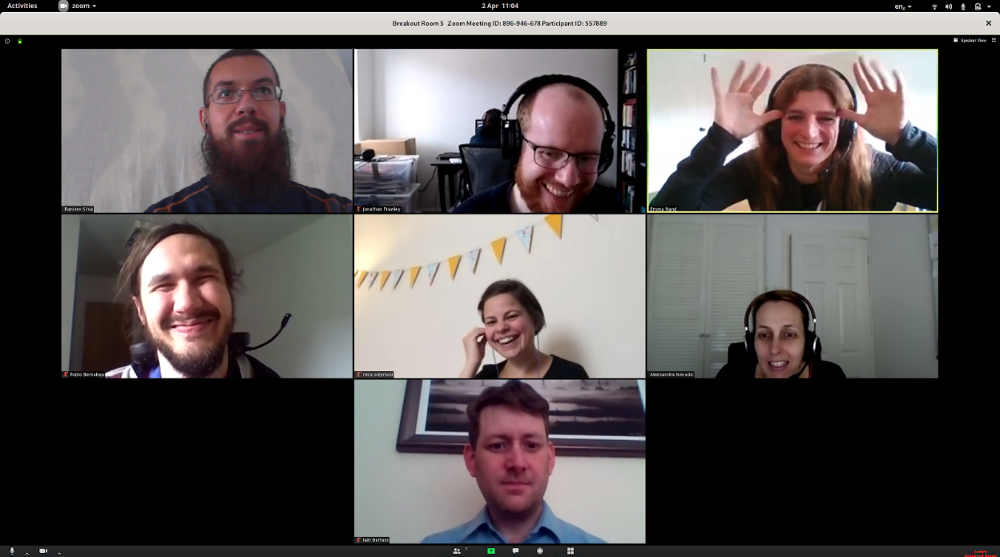

### CW20 - 2020-03-31 to 2020-04-02

Zeta - HP6-CW20

### **Hackday Idea Proposer: Emma Rand**

**“**Storyboarding Sustainability”

---

### **Context / Research Domain**

Many research domains where PIs may not have an awareness of reproducibility and sustainability best practice, may not consider it is relevant to their group or may not know where to start.

### **Problem**

PIs are not always aware of the need to consider sustainability from the start of their project. They may be unable to reproduce data, e.g. reproducing figures which were created by a PhD student who has moved on. They may not build time into grants for ensuring sustainability/reproducibility. Alternatively, the PI is aware of gaps in their understanding and little idea of where to start addressing this problem.

### **Solution**

We want to produce a storyboard/script for a 10 minute video which can be sent to PIs. The video will:

* Make the point that it applies to their research group
* Outline clear benefits of working sustainably
* Outline issues that arise by not doing so
* Suggest key questions they can ask their group members
* Signpost some fundamental small steps they can do quickly/easily
* Signpost training resources for their group members and for themselves.

The script and storyboard will be made available on GitHub so that groups or institutions can easily produce their own video. Ideally, it will be easily tailored to different domains, e.g. ‘hard’ sciences, social sciences, digital humanities.

We could ask our CW20 attendee colleagues for horror stories for non-sustainable approaches to give anecdotes.

### **Diagrams / Illustrations**

_You can include diagrams in this section. Please ensure you have the right to use the image(s), and include an attribution if applicable._

    1. Output would be a storyboard for a video (~10 mins) to persuade PIs to lead their research groups into working sustainably.
    2. The key themes:
        1. Identify what best makes the point that it applies to their research group even if they don’t do software. Needs to be encapsulated in the video title
        2. Articulate the imperatives/benefits of working sustainably in a way PIs will recognise as directly useful to them in terms of saved time/increased productivity or impact or  research integrity
        3. Suggest key questions they can ask their group members
        4. Signpost some fundamental small steps they can do quickly/easily
        5. Signpost training resources for their group members and for themselves.

Tell a story: follow a PI through their journey to working more sustainably. Graphic novel. Somebody shows a PI that is is do-able and what to do

* Identify what best makes the point that it applies to their research group even if they don’t do software. Needs to be encapsulated in the video title
    * Relatable character and reference ‘scandals’ in repro
    * Power pose - did not replicate: newspapers headline “Power posing doesn’t replicate!” ?
    * Excel gene accession example?
    * “Ghost” of past code/data/PhD students/PIs
* Outline clear benefits of working sustainably
    * Saving time and money
        * Read reviewers comments asking for a change to a figure; frustrated PI trying to find files, recreating a figure from scratch vs a PI just changing a variable and pushing a button.
        * Phd student relay vs journey that each phd student has to start
        * Building research group resources
        * Have a virtual phd student from the past inducting/training new phd students. Or, in a similar, futuristic scenario that’s impossible for now, we could picture a lab/department member backing up their mind’s _drive_ as a way of cumulative knowledge and version control. The final message would be that, at present, this is done on lab logs and databases, StackExchange, Git/GitHub,...
    * Increasing impact (Ref), increasing citations and visibility, more collaborations, raising personal/group profile. Examples? Reference for effect:
        * Increased citations with open data: [https://arxiv.org/abs/1907.02565](https://arxiv.org/abs/1907.02565)
        * This is more about open access, so maybe not quite it though.. (https://journals.plos.org/plosone/article?id=10.1371/journal.pone.0203156)
    * Increased connections & networks - Cross domain connections. Access to a world-wide support network
* Outline issues that arise by not doing so
    * Collect. Mistakes. 
* 
* Signpost some fundamental small steps they can do quickly/easily (need to be high level e.g., encapsulate notions of version control rather saying learn git).
    * Suggested techniques (and then have corresponding resources listed later):
        * Recording general practices such as contacting specific technical support, SSI, library, etc. For instance, when a Freedom of Information Request is made, it is published, to save processing time in future.
        * Version control (including hosting)
        * Data repositories
        * List of resources used
        * ...
    * Central place to share and collaborate
        * E.g. Open Research Group github organisation/ gitlab, shared drive
    * Have a system for organising shared files (e.g. think FAIR but locally)
    * Find people doing it/ supporting it: Institute’s own open science group, library. RSE group, UKRN, domain specific, user groups
    * Signpost training resources to your group members
        * Highlight resources such as [the Carpentries](https://carpentries.org/), [Turing Way](https://the-turing-way.netlify.com/introduction/introduction), [the Software Sustainability Institute](software.ac.u)

## STORY BOARD:

<table>
  <tr>
   <td colspan="2" >INTRO
<ul>
<li>Dreadful situation with professor receiving peer-review requesting modification of previous figures for which there’s no reproducible code.

<ul>

<li>Checklist of questions like:  
<ul>

<li>Do you collect/ record/ recode/ analyse/ report on data electronically?

<li>Do you spend lots of time repeating tasks manually or answering the same questions over and over?

<li>“Have you spent hours trying to locate your or your lab’s or students’ files?

<li>Do you always know which is the most recent version of your paper/graphs/code?

<li>Have you spent a day trying to re-do some analysis or change a graph in response to reviewer comments?
</li> 
</ul>

<li>If you answered yes to any of the above, join the “new wave” of open and sustainable research
</li>
</ul>
</li>
</ul>
   </td>
  </tr>
  <tr>
   <td colspan="2" >WHY DO OPEN & SUSTAINABLE RESEARCH?
<ul>

<li>There is a general shift towards open and sustainable research from funders, publishers and grassroots (include here a graph or general stats on open research)

<li>Benefit to you, to your institution, and your entire research field 
<ul>

<li>Reusability for saving time and money

<li>Increasing impact (REF), increasing citations and visibility, raising personal/group profile

<li>Increased connections & networks, more collaborations, not working in isolated silos 
</li> 
</ul>

<li>For the greater good of society and advancing research in general
</li>
</ul>
   </td>
  </tr>
  <tr>
   <td>ISSUE 1

Replication issues: Power pose - did not replicate: newspapers headline “Power posing doesn’t replicate!” ?
   </td>
   <td>SOLUTION 1

Code-based analysis (vs point-and-click like SPSS) allows you and others to audit. Releasing data and code allows others to attempt to replicate. +++?
   </td>
  </tr>
  <tr>
   <td>ISSUE 2 

Sharing data (whenever possible) and results (including null results) is a moral obligation (research funding often from taxes)
   </td>
   <td>SOLUTION 2

Share Data on an open data repository (your institution might have one), preferably one which gives a DOI or permanent link?
   </td>
  </tr>
  <tr>
   <td>ISSUE 3 

Excel gene accession example?
   </td>
   <td>SOLUTION 3
   </td>
  </tr>
  <tr>
   <td>ISSUE 4

“Ghost” of past code/data/PhD students/PIs

Phd student relay vs journey that each phd student has to start

Building research group resources

Have a virtual phd student from the past inducting/training new phd students. Or, in a similar, futuristic scenario that’s impossible for now, we could picture a lab/department member backing up their mind’s <em>drive</em> as a way of cumulative knowledge and version control. The final message would be that, at present, this is done on lab logs and databases, StackExchange, Git/GitHub,...
   </td>
   <td>SOLUTION 4 

<a href="https://amor.cms.hu-berlin.de/~knoeferp/resources/Maquate_etal_Lab_Procedure_2020.pdf">Template of a lab protocol</a>
   </td>
  </tr>
  <tr>
   <td>ISSUE 5 

Read reviewers comments asking for a change to a figure; frustrated PI trying to find files, recreating a figure from scratch vs a PI just changing a variable and pushing a button.
   </td>
   <td>SOLUTION 5 

Easy to re-run code if written following best practices and well documented. 
   </td>
  </tr>
  <tr>
   <td>ISSUE 6

No one’s citing my work :(
   </td>
   <td>SOLUTION 6

increasing impact (REF), increasing citations and visibility, more collaborations, raising personal/group profile. Examples? Reference for effect:

Increased citations with open data: <a href="https://arxiv.org/abs/1907.02565">https://arxiv.org/abs/1907.02565</a>

<a href="https://journals.plos.org/plosone/article?id=10.1371/journal.pone.0203156">https://journals.plos.org/plosone/article?id=10.1371/journal.pone.0203156</a> 
   </td>
  </tr>
  <tr>
   <td>ISSUE 7

I’m all alone, no one gets me :( 
   </td>
   <td>SOLUTION 7

Increased connections & networks - Cross domain connections. Access to a world-wide support network. “Found my tribe!”
   </td>
  </tr>
  <tr>
   <td>ISSUE 8 \
I do not know/understand this. This is too difficult. I have never written code before.
   </td>
   <td>SOLUTION 8

Gaining new skills, increased confidence and personal development. 
   </td>
  </tr>
  <tr>
   <td>HOW DO I GET THERE?
<ul>

<li>Recording general practices such as contacting specific technical support, SSI, library, etc. For instance, when a Freedom of Information Request is made, it is published, to save processing time in future.

<li>Version control (including hosting) needed with less limitations than Dropbox, etc., as some of these only allow retrieving the last 100 versions, retrieving deleted files for 30 days only, etc.

<li>Data repositories

<li>List of resources used: e.g., StackExchange for multiple disciplines ranging Linguistics to Sports (<a href="https://stackexchange.com/sites">https://stackexchange.com/sites</a>).
</li>
</ul>
   </td>
   <td>SMALL STEPS YOU CAN TAKE NOW
<ul>

<li>Take a look at GitHub.com
</li>
</ul>
   </td>
  </tr>
  <tr>
   <td colspan="2" >FURTHER RESOURCES
<ul>

<li>The Turing Way

<li>The Carpentries

<li>The Software Sustainability Institute 

<li>...
</li>
</ul>
   </td>
  </tr>
</table>

### The presentation (5 minutes)

Demo consists of walking through the slides with an introduction of the aims.

### Criteria

5minutes - scored 1 - 5 in each category

#### 1. Novelty, creativity, coolness and/or usefulness

Define problem clearly: 

We are doing a sales pitch for a video which explains to PIs/researchers the benefits of performing “sustainable research”.  We developed a number of slides, which we’ll show in the demo (and are in _this link_).  The slides form a storyboard of the video, with accompanying notes explaining the narrative.  This document further details the creative discussion and motivation. We intend the video to be appealing and not too information dense with the aim of motivating change.

The proposed video aims to promote sustainable research practices across all scientific domains - casting a wide net over all PIs and group or lab leads that need help and guidance in this area but do not necessarily identify themselves as people who write scientific code. PIs who haven’t previously been exposed to best practice should become aware of the benefits (and the pitfalls of not following).

#### 2. Implementation and infrastructure  

The concepts included in the storyboard are not novel, but the formulation of the video storyboard is.

The storyboard can be shown in the demo and conveys our vision of what the video should contain and the style of the presentation.

Video made with OBS-Studio and stock music from: https://www.bensound.com

#### 3. Demo and presentation

Emma Rand, Reka Solymos, Iain Barrass, Pablo Bernabeu, Esther Plomp,Aleks Nenadic	Jonathan Frawley

1. (jonathan sharing screen paused on first slide) Introduction (Emma): 30 second intro what we were aiming to do - writing a storyboard for a video which would be a sales pitch for working sustainably to PIs who may not identify their research groups outputting software. 
2. (jonathan sharing screen play video )Mock-up video: [https://drive.google.com/file/d/1Bh89T7ALt3qxuVeUGT7TBgsSxZrON5zl/view](https://drive.google.com/file/d/1Bh89T7ALt3qxuVeUGT7TBgsSxZrON5zl/view) 
3. (jonathan sharing screen pauses video and switches to github )Next steps (Aleks):
    * How to get involved with the project: [https://github.com/anenadic/research-sustainability-storyboard/blob/master/README.md](https://github.com/anenadic/research-sustainability-storyboard/blob/master/README.md)
    * Documentation for the project and a list of issues that need working on
    * Help us recreate the video and publicise/share the storyboard at your groups and institutions 
4. Judging criteria (Pablo):
    * How we’ve met the criteria, mentioning concrete examples

5. Jonathan to show this!

#### 4. Project transparency

For generating the storyboard (and these notes) we used various collaboration tools (Zoom, Slack, Google Doc and Slides) shared between the team members. The team did not generate any source code but the project documentation is kept at GitHub: [https://github.com/anenadic/research-sustainability-storyboard](https://github.com/anenadic/research-sustainability-storyboard).

#### 5. Future potential

One hopes that the storyboard would be developed into a full video.  Equally, the storyboard remains available for other interested people to develop (including customizing it for a particular specific setting/discipline). 

We hope that the storyboard will inspire and encourage more PIs and group leads to start implementing (some of the) best practices around open and reproducible research and joining the community.

The idea of this video development process will hopefully inspire similar efforts reflecting other aspects of open research.

#### 6. Team work

The work was amenable to being split between team members.  Once we had content arranged, individual slides could be generated in parallel.  Art work could proceed (and the “clean” versions created) independently; these notes were also written.  Overall final review was completed with all team members.

This work was non-technical and mostly creative.

We definitely had more ideas working together than we would separately. We used google slides.

Atmosphere was good, everyone contributed in interesting and unexpected ways. There were no real disagreements. Discussions

Everyone was very friendly and we had fun. Agreed!
