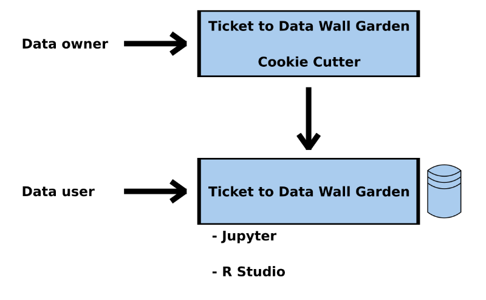

### CW20 - 2020-03-31 to 2020-04-02

Delta - HP4-CW20

Ticket to Data Wall Garden

Join #hackday-delta on Slack

### **Hackday Idea Proposer**

Raniere Silva

---

### **Context / Research Domain**

All domains that generate data.

### **Problem**

Researchers have a collection of data (for example, images, audio, video, …) they want to make available to other researchers and students but they want to have some metric of how many people are using their data so they can apply for more funding to produce more data.

### **Solution**

Online Cookie Cutter to create GitHub or GitLab repository with Docker and Kubernetes files to be deployed in AWS, Azure or Google Cloud with Jupyter Notebook or R Studio and a Data Storage Volume for the data that the research has.

### **Diagrams / Illustrations**

### Expertise Needed

* AWS, Azure or Google Cloud configuration
* Docker & Dockerfile
* Binder, Jupyter Notebook or R Studio
* Web Design
