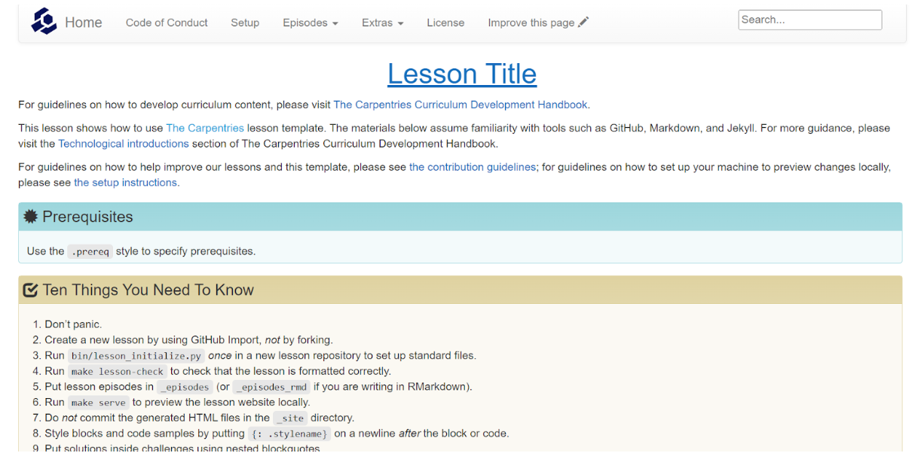

### CW22 - 2022-04-04

#### **Hack Day Idea proposer**

_Saranjeet Kaur Bhogal, Heather Turner_

#### **Hack Day Idea title (provisional)**

_Carpentries-style Lesson on R’s Bug Tracking Process_

#### **Hack Day Pitch**

<iframe width="560" height="315" src="https://www.youtube.com/embed/fUcOcrhI0Ho" title="YouTube video player" frameborder="0" allow="accelerometer; autoplay; clipboard-write; encrypted-media; gyroscope; picture-in-picture; web-share" allowfullscreen></iframe>
#### **Context and/or research domain**

_Software sustainability._

**Problem**

_We have been conducting monthly ‘[Collaboration Campfires](https://contributor.r-project.org/events/collaboration-campfires)’ that are informal sessions to discuss and learn how to contribute to the R project. These campfires are a part of the Digital Infrastructure Incubator by the Code for Science & Society. For facilitating and supporting these campfires we plan the sessions on etherpad which includes activities that help newcomers to become familiar with the tools that the R project is based on. This infrastructure has worked well for organizing and running the sessions. Now we would like to turn them into a resource that is more permanent, useful for potential organizers to re-run or for potential contributors to use for self-learning._

#### **Solution**

_To make the Collaboration Campfires material sustainable and available to the future learners, we want to build reusable beginner-friendly lessons for contribution to the R project, using the materials that we have been creating for the campfires and host them on our webpage ([https://contributor.r-project.org/](https://contributor.r-project.org/)). We propose to use the [Carpentries lesson template](https://github.com/carpentries/styles/) as demonstrated by their [example lesson](https://github.com/carpentries/lesson-example). For this hack day, we will convert the material from two Collaboration Campfires: “[Explore R’s Bug-tracking Process](https://developer.r-project.org/etherpad/p/collaboration_campfire_february)” and “[How to Help Review R Bug Reports](https://docs.google.com/document/d/1rAerV1_Kw_lX_M4XwqEdIxvakYfREarBsfLmoK0vUEk/edit)” into a single lesson. \
 \
We will be using RStudio to create these lessons (as described in [The Carpentries Workbench](https://carpentries.github.io/sandpaper/) documentation) and GitHub Pages for deployment ([GitHub repo](https://github.com/r-devel/r-bug-tracking-lesson)). We will use the Collaborations Workshop 2022 Slack (#quail), Zoom and GitHub issues for communications._

**Diagrams / illustrations**

Screenshot of the Carpentries Example Lesson, [CC BY 4.0](https://creativecommons.org/licenses/by/4.0/), Copyright © [The Carpentries](https://carpentries.org/).

---

 **Licence**: These materials (unless otherwise specified) are available under the Creative Commons Attribution 4.0 Licence. Please see the [human-readable summary](https://www.google.com/url?q=https://creativecommons.org/licenses/by/4.0/&sa=D&source=editors&ust=1647286701848565&usg=AOvVaw2qzzsFEYcLbj2RBgWTnqok) of the CC BY 4.0 and the full [legal text](https://www.google.com/url?q=https://creativecommons.org/licenses/by/4.0/legalcode&sa=D&source=editors&ust=1647286701848885&usg=AOvVaw2j7FJHe5VtmTv8oneo9jHX) for further information. \

