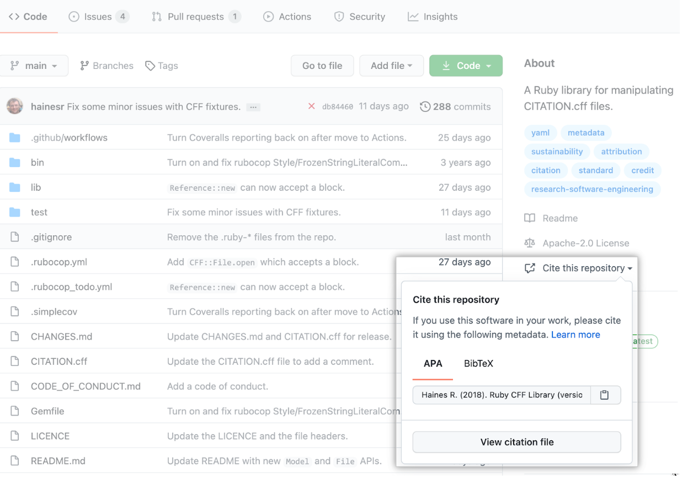

### CW22 - 2022-04-04

#### **Hack Day Idea proposer**

Stephan Druskat

---

#### **Hack Day Idea title (provisional)**

CFF in the wild - analysing software citation metadata file usage

#### **Context and/or research domain**

Software citation affects all domains producing research software.

#### **Problem**

The [Citation File Format (CFF)](https://citation-file-format.github.io/) enables authors of research software to provide the citation metadata for their software in a human- and machine-readable way, so that their software can be cited correctly.

Recently, some platforms and tools have integrated CFF to work with software citation metadata, most prominently GitHub, who use it to present citation information for repositories in their UI (see Fig. 1 below. This led to quite a bit of uptake of the format: as of today, there are over **[7,000 CITATION.cff files on GitHub](https://github.com/sdruskat/cfftracker)**. Informally at least, it is therefore safe to assume that people actually find this helpful.

The question is: **helpful in doing what exactly**? Are people using CFF files to enable the citation of their software in the source code repository directly? Or are they pointing to a DOI of a more formally published version on, e.g., Zenodo? Or a DOI pointing to the software project as a whole (a parent DOI, or “concept” DOI as it’s called on Zenodo)? Or are people using CFF files to point to a paper, either by using the `preferred-citation` field in CFF, or by hacking the format to provide a DOI to a paper as if it was a DOI to the software? Do CFF files reflect the state of the repository (is the last release made citable?), are they maintained at all? Do people provide other metadata files alongside CFF files?

An answer to that question would help us understand

1. the current practice of software citation as understood by software authors, reflected in CFF files;
2. the degree to which people follow the [software citation principles](https://peerj.com/articles/cs-86/) in practice (e.g., enable other to cite the software directly, or - if they enable citation of a paper - also enable citation of the software itself);
3. how to further develop CFF to support good practice according to the software citation principles;
4. to inform further outreach within and beyond the research software community to push for better software citation practice.

#### **Solution**

To help us answer some of the questions above, we will analyse the existing CFF files on GitHub, and the repositories they’re provided in. The required data can be retrieved via the GitHub API, and analysed by a variety of methods.

One output of this hack would be a simple open source command line tool that retrieves `CITATION.cff` files from GitHub. If and when the GitHub search API has recovered from its hiccups.

Another output of this hack would be an open source computational analysis workflow working on the set of retrieved `CITATION.cff` files. The workflow should be able to reliably reproduce the results and visualizations.

A third output of this hack would at least provide a document with visualizations of the analyses and preliminary interpretations, and an idea of future research that can be informed by the results. The latter may be implemented as a blog post, a website, or turned into a collaborative paper.

**Useful, but not required, skills/experience** for this hack could include 

* interest in or experience with REST APIs, especially the GitHub API
* interest in or experience with data analysis
* interest in or experience with writing documentation
* interest in or experience with data visualization
* interest in or experience with software citation details or the software citation principles
* interest in or experience with summarizing research results

#### **Diagrams / illustrations**

##### Fig. 1: Citation information from Citation File Format files (CITATION.cff) are displayed on GitHub repositories in a widget. Source: https://docs.github.com/en/repositories/managing-your-repositorys-settings-and-features/customizing-your-repository/about-citation-files.

---

 **Licence**: These materials (unless otherwise specified) are available under the Creative Commons Attribution 4.0 Licence. Please see the [human-readable summary](https://www.google.com/url?q=https://creativecommons.org/licenses/by/4.0/&sa=D&source=editors&ust=1647286731518666&usg=AOvVaw2FFf_xI0R6qiDobWLeobg0) of the CC BY 4.0 and the full [legal text](https://www.google.com/url?q=https://creativecommons.org/licenses/by/4.0/legalcode&sa=D&source=editors&ust=1647286731519367&usg=AOvVaw1MdoS3iufm50t5PkSYHOSt) for further information.
