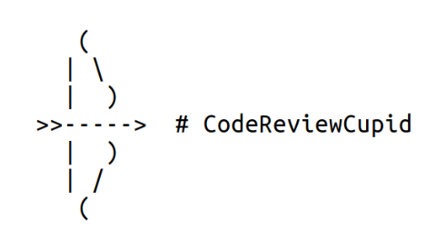
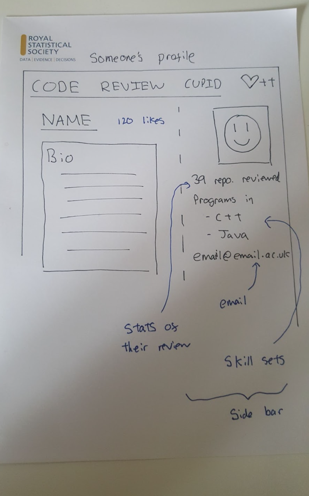
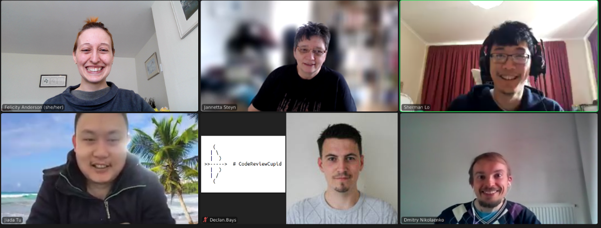

### CoccomCW22 - 2022-04-04

## **Hack Day Idea: Dove**

#### **Hack Day Idea proposer**

**Felicity Anderson, Sherman Lo, Dmitry Nikolaenko (alphabetical order)**

**(others in H-Heather can add their name and chip in too!)**

---

#### **Hack Day Idea title (provisional)**

**Code Review Cupid**

#### **Context and/or research domain**

Successful multidisciplinary research can require the e writing and maintenance of complex software.

We don’t always have time to learn everything at once - so finding peers who can help us improve is key! The key here is reciprocity - I will review yours if you review mine.

But how do we find people who have the skills we need??

#### **Problem**

_Finding code reviewers is difficult. Code reviewing when there are more researchers than RSE is not sustainable, there needs to be something more sustainable._

Time-poor RSEs often don’t have time to search out people who can help, nor do we want to spend lots of time reviewing others’ code while getting nothing in return. 

RSEs and researchers might also not be able to attend in-person events, or might not be in a position to make connections outside their field, and often the interdisciplinary exchange of ideas is what we need to really improve our code or projects.  

* **Finding code reviewers is hard and there needs to be a more sustainable way to code review other people’s code rather than relying on RSE**
* **RSEs and researchers might also not be able to attend in-person events, or might not be in a position to make connections outside their field, and often the interdisciplinary exchange of ideas is what we need to really improve our code or projects.**  
* **Tricky to know what people feel confident enough to help with**  

#### **Solution**

* **A buddy/pairing system based on people’s expertise.**
* **Basic user profile generated by user**
* **The software can add to a cupid (web/HTML) profile by crawling through their public GitHub/Twitter/Linken account to fetch statistics, such as commonly used programming languages, domain expertise, commonly used scientific terms in their Tweets….**
* **The cupid profile may also contain**
    * **A user written bio** 
    * **Key skills users can contribute (e.g. documentation)**
    * **Skills users are looking for help with (e.g. testing)**
    * **What they want to review and be reviewed**
* **he statistic can be used to make a similarity score between pairs of cupid profiles_._**

Can make use of existing GitHub stats software eg [https://github.com/jstrieb/github-stats](https://github.com/jstrieb/github-stats) together with other existing software to crawl through public accounts and fetch statistics.

What we need to make Code Review Cupid a reality: 

* Softer skills / self-reflection skill-description advice documentation options for non-coders who want to get involved
* Code review tips documentation - ideal for folks who’ve got Code Review experience! 
* Web skills and DB options for the backend 
* matching algorithm query magics required 
* data entry form design for participant data gathering 
* design skills needed for frontend

The team/time can be divided with the following objectives:

Basic Level: 

* Web / Design :_ Code Review Cupid **website** (the backend could be written in Django) - _Web design and generation for a single cupid profile, given the short time frame, it can either be static or dynamic 
* Data: **Basic profile** generation (bio, ‘confident with’ and  ‘would like help with’ skillset keyword selection, social profile links, contact preferences) 
* Docs: Pointers to existing documentation **resources** (e.g. code review advice, tips - _Suggestions on how to carry out a code review, give and receive helpful feedback and more. _) 
* DB / Web: Small **database** of participant data (their skill sets, software engineering specialties and interests, etc, perhaps as a table listing software technologies and skills as columns and coders as rows) 
* Data: Keyword match / complementarity between profiles aka **_Matchmaking algorithm: _**
    * ? users could select whether they want to find someone with same skills (match e.g. “wants x” matches “wants x”) or complimentary skills  (inverse match e.g. “has x, wants y” would match with “has y, wants x”) 
* Design: **Logo** :D 
* Design: **Presentation**  
* Docs: Decide on code of conduct 

Tasks/Ideas for Non-coders: documentation, design, data-entry form design, keywords ontologies?, code of conduct, logo,    

Even Smaller Prototype Note: if we don’t have sufficient web-stuff up and running, we could at least generate some example profiles with example data, figure out some data-matching methods, and create an outline data-collection form / data structure? 

Stretch Levels (optional features)  

* Hard and optional: implementing a similarity score between pairs of cupid profiles 
* Find existing (or implement) software to draw useful statistics from a user’s public GitHub, Twitter, …etc to be displayed on the cupid profile
* Try and balance matching experts with beginners
* Social media ‘likes’ or credit system to show credibility of a user
* Newly developed resources / documentation: 
    * _Advice on how to fill out your profile to get the best results _
    * _Tips on how to build and maintain your coder buddy partnership in future_
* _The algorithm could also help suggest potential reviewers or authors that an applicant might consider contacting after they’re happy with their code_

#### **Diagrams / illustrations**

_FA: possible logo?_

_Skillsets:_

SL: an RSE, ML & stats,  scientific computing (python, R, C++), no java/html5 web dev. Can do static HTML tho. Knows Java. 

FA: PhD Researcher, R, some Python, collaborative coding experience w/ students, documentation, data (mostly in R)

DN: an RSE, numerical simulation, HPC skills, C++, C, django  

JS: an RSE, software development, Java (including a little web thing running from a database), html5, css, Ajax for web,  

JT: mech eng background, FORTRAN, python, R, MATLAB, 

AMAA: comp sci & applied maths, python, some HTML,  

DW: an RSE, physics/bio, django web apps, vue.js Javascript frontend, patchy availability due to puppy :D 

DB: maths modeller, 

IB: an RSE team leader,  

— 

Vision for the product: 

SL: pair matching folks with matching expertise to help establish buddy connections for sustainable code review. 

Web page containing a person’s CRC profile (bio, prog lang prefs, expertise, etc), potentially grabbed by a public crawler which pulls data from linked profiles (e.g. github, twitter) 

More data is better, so public data on the profile can help people decide. 

Stats can help pair. 

FA: thinking about generating minimal profile examples and how to match the data. Perhaps supply list of keywords and ontologies to connect similar terms / complimentary skills. Basic data entry form would be a good proof of concept. 

DN: Thinking about database holding the profile information - tables of skills people have vs skills people want? Django might be a good backend because it handles DB parts, and frontend might be html/javascript for web interface 

Suggestions / Discussion: 

JS: this might be a good product for people to find their ‘rubber duck+’ - ie someone who can listen to your idea and ask helpful critical questions to help you improve it 

JS: perhaps wouldn’t go for Django, might go Java instead personally 

JS: for the hack day, it might be helpful to just match similar keywords from the skills DB, but in future it might be a good idea to offer several ‘algorithm options’ (ie user could select if they prefer x to x, or x to y matching). +1 from DW. 

DW: following on from DN’s Django database visions - perhaps might be better to keep 1 table which doesn’t separate reviewers vs reviewees, perhaps with a couple of boolean flags for indicating whether a user is a reviewer or reviewee

JT: Try and balance matching experts with beginners, do we need to offer credit? Having a credit system might help people review

SL: Social media ‘likes’ or credit system to show credibility of a user

AMAA: a credit system might be helpful - if you’re an intermediate python writer, you might look for a more experienced reviewer, but can offer to review beginners’ code. 

DN: a mathematical model might be great, but it could be less complex for implementation in the short term. 

JS +1 to DN’s idea to add future ideas to github issues 

FA: to think about minimal example

JS: recently github website w/ Jekyll template with specification requirements for a student - puts them up as issues. 

JT: thinking about the papers review system - selecting several reviewers who could review your paper, and they could also decide whether to  

SL: can we reduce intimidation barriers to people reviewing code? 

JS: kudos systems can be gamed - people might upvote/downvote to get credit. To make sure people don’t get intimidated, this would be helpful 

DB: we could keep rankings blind to avoid ‘gaming’. 

JT: the more code you review, the higher a ‘level’ you might achieve in our scoring system. 

DN: this ‘scoring’ could be a good feature to put into our documentation / TODOs issues instead of an initial prototype feature. Points may or may not be visible/blind to other users. 

What information do we need to help users decide whether to get in touch with a code review buddy?  

* Credibility / amount of code someone’s written / stage of career (e.g. look at their bio, keywords), ‘credit’ (likes/reposts/review stats).  
* What are their skills 
* What kind of work do they do 
* How long have they been doing it? 
* Are they an approachable person / reviewer? 

MVP: minimal viable product: 

DW: How would users get in touch with each other? Would we build a messaging platform?

FA: Perhaps instead, users specify their preferred contact method which is revealed to their match one the match is made.

JT: we need to think about data security! 

FA: Fictitious data to deal with GDPR, but worth mentioning in our presentation  

JS: could use github pages, csv file & Heroku (free) to host. (JS’s example is here: [https://github.com/NewcastleRSE/WorkshopScheduler](https://github.com/NewcastleRSE/WorkshopScheduler)) 

DW (post-hoc): pythonanywhere is another option for a python-based backend (e.g. [reprohack hub](https://www.reprohack.org/) is hosted on pythonanywhere)

TODOs: 

* Choose license (DONE)

* Collaboration guidance for project 

* Choose code of conduct for product 

* Make Repo with relevant gitignore / license 

* Team photo 

* Create website 

* Create presentation 

* Create mock profile data 

* Create github issues for these TODOs :) 

Presentations & Demos at **1550**! 

Janetta - website setup

Declan - database & data generation 

Sherman - website & static html 

Dmitry, Jiada - README, documentation. Projects 

Jiada - been working on README with Dmitry. TO CONTINUE.  

Sherman - static website, no interaction with the database, created profile from the mock data. Has score, some social media bit, list of skills and key words. Middle shows username, pic, whether they can review or want to be reviewed. Biog, history, etc. 

Jannetta - web app on Heroku, Readme in the website repo within the organisation. 

TODO: landing page for website 

TODO: data entry form for new user profile.  

TODO: presentation discussion. 

SL: should perhaps avoid slides, and the demo person should talk. Then after the demo we can talk, one person speaking at a time.  

SL: in terms of demoing and talking about it, then at least one person afterwards. 

SL: opening section (describe product, objectives, then present product, then further implementations)

3x folks, then speaking only for 1min each.  

---

 **Licence**: These materials (unless otherwise specified) are available under the Creative Commons Attribution 4.0 Licence. Please see the [human-readable summary](https://www.google.com/url?q=https://creativecommons.org/licenses/by/4.0/&sa=D&source=editors&ust=1647286355032311&usg=AOvVaw1CQS6uQ2ixJPJpKSEjApGd) of the CC BY 4.0 and the full [legal text](https://www.google.com/url?q=https://creativecommons.org/licenses/by/4.0/legalcode&sa=D&source=editors&ust=1647286355032501&usg=AOvVaw36TgMJ89CXdpq4U0LsnXzx) for further information.
