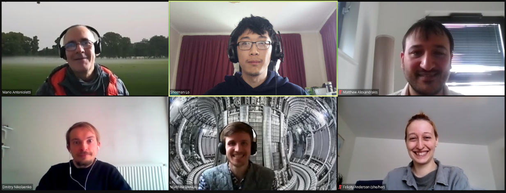
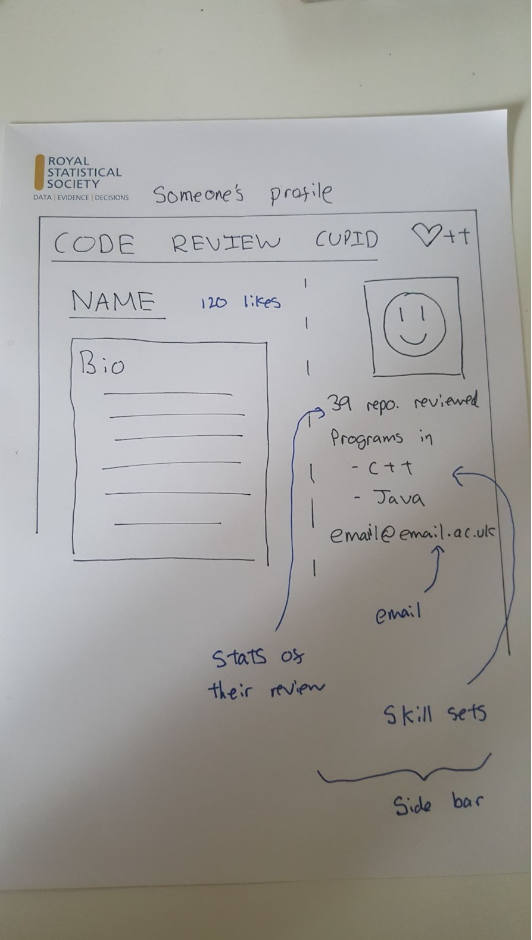

### CW22 - 2022-04-04

## **Collaborative Ideas session group:  The **Code Review Cupid (H-Heather)

 [[from the  clipart library](http://clipart-library.com/pic-of-cupid.html)]

#### **Participants**

* Sherman Lo / RSE, Queen Mary, University of London/ London / s.lo@qmul.ac.uk / Twitter @shermanlo77 / Github @shermanlo77
* _Matthew Alexandrakis, RSE Queen Mary University of London, m.alexandrakis@qmul.ac.uk_
* _Dmitry Nikolaenko, RSE / Durham University, [dmitry.nikolaenko@durham.ac.uk](mailto:dmitry.nikolaenko@durham.ac.uk)_
* Felicity Anderson, EPCC PhD Researcher, University of Edinburgh, [Felicity.Anderson@ed.ac.uk](mailto:Felicity.Anderson@ed.ac.uk) 
* Matthew Bluteau, RSE at UK Atomic Energy Authority, [matthew.bluteau@ukaea.uk](mailto:matthew.bluteau@ukaea.uk) 
* _Mario Antonioletti, EPCC/SSI University of Edinburgh, [mario@epcc.ed.ac.uk](mailto:mario@epcc.ed.ac.uk)_

#### **Group photo**

---

#### **Collaborative Idea Title**

**_The Code Review Cupid - a matchmaking service for connecting coders_**

#### **Context / Research Domain**

_Successful multidisciplinary research can require the e writing and maintenance of complex software._

_We don’t always have time to learn everything at once - so finding peers who can help us improve is key! The key here is reciprocity - I will review yours if you review mine._

_But how do we find people who have the skills we need??_

#### **Problem**

_Finding code reviewers is difficult. Code reviewing when there are more researchers than RSE is not sustainable, there needs to be something more sustainable._

Time-poor RSEs often don’t have time to search out people who can help, nor do we want to spend lots of time reviewing others’ code while getting nothing in return. 

RSEs and researchers might also not be able to attend in-person events, or might not be in a position to make connections outside their field, and often the interdisciplinary exchange of ideas is what we need to really improve our code or projects.  

#### **Solution**

Our solution would be a web service to help researchers find someone else to review their code.

_Code Review Cupid consists of:_

* _Code Review Cupid website (the backend could be written in Django)_
* _Coder Profile data entry form_
* _Small database of participant data (their skill sets, software engineering specialties and interests, etc, perhaps as a table listing software technologies and skills as columns and coders as rows)_
* _Matchmaking algorithm to match participants with other coders who have complimentary skills and knowledge_
* _Advice on how to fill out your profile to get the best results_
* _Suggestions on how to carry out a code review, give and receive helpful feedback and more._
* _Tips on how to build and maintain your coder buddy partnership in future_
* _The algorithm could also help suggest potential reviewers or authors that an applicant might consider contacting after they’re happy with their code_

_Once the website is written, it can be uploaded on a cloud application platform such as Heroku for free testing_

Fill out a profile of your skills and requirements - do you need someone who can help you improve your testing? Can you help other people improve their READMEs or metadata? 

Everyone can contribute something, and there’s plenty to gain from signing up! 

The system takes your profile and our special matchmaking algorithm matches you with someone who has the skills you’re looking for, and who you can help in return. 

Share your contact details with your selected match and make contact - you can then proceed however suits you both and use the advice and tips we supply on how to make the most of your new coding connection - Code Review Cupid’s work is done! 

What we need to make Code Review Cupid a reality: 

* Softer skills / self-reflection skill-description advice documentation options for non-coders who want to get involved
* Code review tips documentation - ideal for folks who’ve got Code Review experience! 
* Web skills and DB options for the backend 
* matching algorithm query magics required 
* data entry form design for participant data gathering 
* design skills needed for frontend

#### **Diagrams / Illustrations**

_Sherman: What I envision of someone’s profile_

_Flic: We could add a section of “What I’m looking for help with?” That would emphasise that it’s a two-way thing, and build that 1:1 link that would make it more sustainable and more mutually helpful._

### Notes

* FA: a gentle intro to HPC for biology / humanities / anything
* DN: the RSE is a great position that requires some
* FA/DN/MA: a match making service for RSEs
    * MA: what will be the motivation for an RSE to come to this and take on unpaid work?
    * MB: perhaps we should lower the bar? Just a short consultancy?
    * SL: more focus on networking? Connect with people with completely different skill sets (GitHub)
    * FA: Making connections rather code review service
* MA: what we are talking about fundamentally is knowledge transfer, and there is no silver bullet

---

 **Licence**: These materials (unless otherwise specified) are available under the Creative Commons Attribution 4.0 Licence. Please see the [human-readable summary](https://www.google.com/url?q=https://creativecommons.org/licenses/by/4.0/&sa=D&source=editors&ust=1647284414142979&usg=AOvVaw0vhmvVOgBkfCuUSSJzW7yb) of the CC BY 4.0 and the full [legal text](https://www.google.com/url?q=https://creativecommons.org/licenses/by/4.0/legalcode&sa=D&source=editors&ust=1647284414143625&usg=AOvVaw0LtwniMT9TDtLA_I7OGiy4) for further information.
