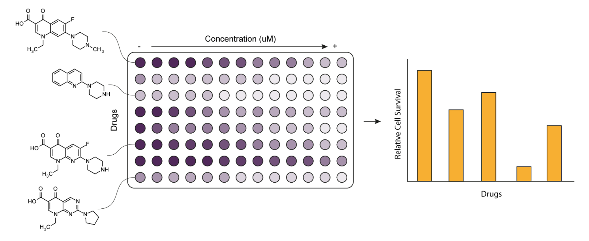

### CW22 - 2022-04-04

## **Collaborative Ideas session group: A-Aloe**

Biological Sciences.

#### **Participants**

* Mark Basham, Rosalind Franklin Institute, [mark.basham@rfi.ac.uk](mailto:mark.basham@rfi.ac.uk) - note taker

* Gemma Turon, Ersilia Open Source Initiative, [gemma@ersilia.io](mailto:gemma@ersilia.io)

* Sarah Forrester, University of York, [sarah.forrester@york.ac.uk](mailto:sarah.forrester@york.ac.uk)  - chair

* Emma Karoune, The Alan Turing Institute, [ekaroune@turing.ac.uk](mailto:ekaroune@turing.ac.uk)

* Vicky Hellon, The Alan Turing Institute, [vhellon@turing.ac.uk](mailto:vhellon@turing.ac.uk) 

* Katy Brown, University of Cambridge, [kab84@cam.ac.uk](mailto:kab84@cam.ac.uk)

#### **Collaborative Idea Title**

_Easy Open Source Bio-Graphs_

#### **Context / Research Domain**

Many biological labs have routine assays or experiments which require standard analysis and produce a well understood graph as an output. _Create a jupyter app or something similar to automate the process of some assay like QPCR and produce the standard graphs/analysis maybee to replace some like graphpad. Possibly in the form of a repository + examples + template_

#### **Problem**

Many researchers use paid tools to conduct analysis on standard experiments, such as Graphpad.  Some easy-to-do analyses have many alternative Open Source softwares but lab-based researchers do not know them, and unless they are deployed in a shiny app or similar, they do not know how to interact with them.

Although these tools might be available in github ([https://shiny.rstudio.com/gallery](https://shiny.rstudio.com/gallery/)), there is a significant barrier to adoption for non-expert scientists.

In addition to the practicality of running the analysis, capturing this in a sustainable and reproducible way is often challenging.

#### **Solution**

The idea would be to develop a Github repository where some basic data analysis pipelines can be developed (or adopted from third party OS repositories) and deployed using a Shiny App or Jupyter App. For example, input qPCR data and get a graph of the gene expression fold-change (and even a simple statistical analysis).

With these tools, researchers would be able to run some analysis using OS software that are currently done in paying software. It would also facilitate the introduction to Python or R coding

The tool could output some kind of ID which links back to both the input data and the code, making the results of the analysis more reproducible than the current closed-source tools.

The initial step would be to build the repository and to provide one or two example pipelines, plus a template to allow other researchers to add pipelines for different analyses.

#### **Diagrams / Illustrations**

Example of the current machine output and standard plotting style for qPCR analysis 
* [https://commons.wikimedia.org/wiki/File:Qpcr-cycling.png](https://commons.wikimedia.org/wiki/File:Qpcr-cycling.png), 
* [https://commons.wikimedia.org/wiki/File:Dapansutrile_and_its_effect_on_NLRPE_mRNA_Levels.png](https://commons.wikimedia.org/wiki/File:Dapansutrile_and_its_effect_on_NLRPE_mRNA_Levels.png)

Example of experimental setup and plotting of a cell survival assay:

Very approximate mock-up

---

 **Licence**: These materials (unless otherwise specified) are available under the Creative Commons Attribution 4.0 Licence. Please see the [human-readable summary](https://www.google.com/url?q=https://creativecommons.org/licenses/by/4.0/&sa=D&source=editors&ust=1647284118803326&usg=AOvVaw2rwFZ2LjQJoXDJoLKVVRn_) of the CC BY 4.0 and the full [legal text](https://www.google.com/url?q=https://creativecommons.org/licenses/by/4.0/legalcode&sa=D&source=editors&ust=1647284118803645&usg=AOvVaw1XIG__IyemG1HVjdsNVZ4Y) for further information.

### Super secret notes

_What we need to do:_

#### Notes from the discussion

Previous example from the hackday : [http://shouldisharemyco.de/](http://shouldisharemyco.de/)

Ideas:

* Community building
* Bringing together Biologists and Computer engineers.
* Lab based software/automation/plotting/
    * Could narrow down to one or 2 pipelines
    * Possibly could use Jupyter ‘app mode’ to hide the code and make it look nice
        * Plotting QPCR data
        * Keep a general form, but with fixed data, some form of standard?
        * Can you make a general standard, or should it be specific?
