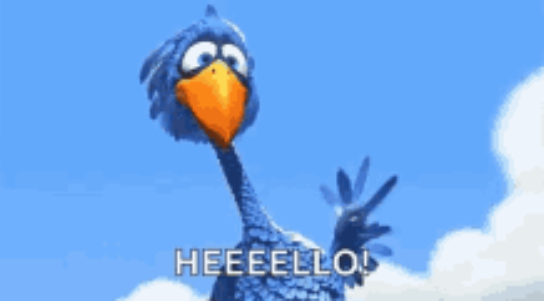

### CW22 - 2022-04-04

## **Collaborative Ideas session group: I-Iris**

#### **Participants**

* _Malvika Sharan / The Alan Turing Institute / msharan@turing.ac.uk_
* Hannah Williams / UKHSA / hannah.williams@phe.gov.uk
* _Neil Chue Hong / SSI / N.ChueHong@software.ac.uk_
* _Hugo Gruson_
* _Adam Jackson / STFC/ adam.jackson@stfc.ac.uk_
* _Kim Martin / Stellenbosch University / [kcmartin@sun.ac.za](mailto:kcmartin@sun.ac.za)_

#### **Collaborative Idea Title**

_Please add a title for your Collaborative Idea here._

**Hi-Brid! **

_Leave no one behind in hybrid working!_

**Fun facts: **

* [https://en.wiktionary.org/wiki/brid](https://en.wiktionary.org/wiki/brid)

**Brid **- from Old English **bridd**, of disputed origin.

Alternative forms:

**_bryd, bird, bred, berd, burd, bord_**

Noun

**brid **(plural **briddes**)

_a young bird, a bird in general_

—

**Leave no one behind: United Nations Sustainable Development Value:** [https://unsdg.un.org/2030-agenda/universal-values/leave-no-one-behind](https://unsdg.un.org/2030-agenda/universal-values/leave-no-one-behind)  

—

**Core concepts:**

* Curating tools and technology (lots of bots exist)
* Set of recommendations for why they are useful
* Adding context on what concerns and considerations they should take so nobody is left behind.
* Maybe a “bot of bots” that sends a reminder for the moderators and facilitators to review their tools, rules and communication process.. collects data on ‘how things are going’ (?)

#### **Context / Research Domain**

Any team that is currently working (or transitioning to) a model of hybrid working, taking into account hot desking, homeworkers and office workers.

#### **Problem**

Why are we interested in hybrid:

* Engaging communities through combination of in person and online opportunity, holding it online first and not leaving behind people who are not in person
* We are thinking about remote first but afraid that folks in remote will be forgotten
* People are less willing to engage online, but when met in person they can have difficult conversation - online loses that social aspect
* Nervous about what hybrid at large org will look like - people who are comfortable will engage and those who are not engaging will not gain the attention they deserve
* Building inclusion in the hybrid communities

**_Anxiety of leaving someone behind or being left behind_**

Problems that hybrid working may result in:

* Concerns about inclusive working
* Fear of leaving people out
* Trust - working arrangements and responsibility, are people getting work done?
* Do some organisations or teams self-select people who have similar interests in platforms or tools?
* Varied range of communication (virtual and physical) resulting in team members feeling overwhelmed, or missing out on crucial information (e.g. if they weren’t in the coffee room when something was discussed)

"_To accomplish any goal with two or more people, the amount of trust between the team members and the amount of communication required are inversely related_." https://medium.com/@elevada/the-trust-communication-trade-off-4238993e2da4

Types of communications - weekly summary points, daily check-ins, more activity in small groups/channels 

Many communication platforms in use: most of them are good at something and solve a problem, but accessibility is variable and certain communication needs still fall through the cracks. Using all of them at once is a poor solution.

People in self-selected groups tend to engage through a set of communication platforms that often doesn’t work when people feel like they have been forced into it. How can we make better choices? What should we know before choosing a platform?

Due to pandemic and long term ‘loss of social interactions’, even folks not willing to engage before are actively trying to shift their mindset - how can we support that?

Advocating for people who are not in the room, practicing inclusive behaviour, making an extra effort that they don’t miss out on what is happening in person.

#### **Solution**

Hi-Brid! Leaving no one behind in hybrid working!

Possible solutions

* Do hybrid online meetings ‘well’
    * Checklists for inclusive hybrid events (screens so remote attendees can be seen - not forgotten; cameras so they can see who is talking etc; good microphones so they can hear; sound systems so they can speak)
    * Having a ‘scribe’ (taking meeting minutes) working in a real-time chat channel can bridge things… they can also read out questions from remote attendees
    * Where real-time hybrid events are difficult (due to bandwidth limitations), use asynchronous text-based platforms instead
    * Recommendations for facilitating online events: [https://hackmd.io/@turingway/facilitating-online-inclusion](https://hackmd.io/@turingway/facilitating-online-inclusion) 
* Review process for how teams can discuss and choose the communication channels they use for hybrid working
    * Curating tools and technology 
    * Set of recommendations for why they are useful
    * Adding context on what concerns and considerations they should take so nobody is left behind.
    * Prompts that can help remind people about ways of interaction
    * Maintain an ongoing conversation about preferences, rather than a “one-time” event
    * Trust and psychological safely in online spaces - policies and guidelines may sometimes feel over engineering interactions, but they work as useful framework for people who would otherwise not engage - allowing flexibility to evolve norms as needed in teams.
    * Tools to help Team Leaders maintain oversight and improve team online / hybrid interactions (including knowing what practices to adopt/drop/change)
        * A way of ‘temperature-taking’ the state of individuals within the group, to feed back on the team practices being used? (a ‘digital therapist’ app… data driven team management?)
        * ‘Semi-automating kindness’ (Malvika’s term) - ways of promoting team-building/psychological safety-promoting practices/interactions?
        * Regular check-ins, prompted by automated ice-breaker-style questions?

#### **Diagrams / Illustrations**

---

 **Licence**: These materials (unless otherwise specified) are available under the Creative Commons Attribution 4.0 Licence. Please see the [human-readable summary](https://www.google.com/url?q=https://creativecommons.org/licenses/by/4.0/&sa=D&source=editors&ust=1647284436882341&usg=AOvVaw2hcUDhDeeCD5J0VR3jabCR) of the CC BY 4.0 and the full [legal text](https://www.google.com/url?q=https://creativecommons.org/licenses/by/4.0/legalcode&sa=D&source=editors&ust=1647284436882680&usg=AOvVaw36FATBHFdpuMUnzOf9Zh10) for further information.
