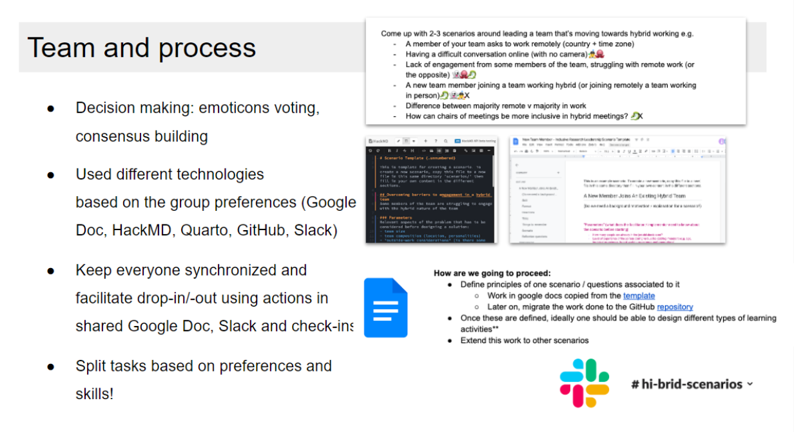

### CW22 - 2022-04-04

## **Hack Day Idea: Albatross**

#### **Hack Day Idea proposer**

* Neil Chue Hong, 
* Tracy Teal

---

#### **Hack Day Idea title (provisional)**

Developing scenarios to help nurture Inclusive Research Leaders

#### **Hack day presentation**

<iframe width="560" height="315" src="https://www.youtube.com/embed/RRWPSQsZvKA" title="YouTube video player" frameborder="0" allow="accelerometer; autoplay; clipboard-write; encrypted-media; gyroscope; picture-in-picture; web-share" allowfullscreen></iframe>

#### **Context and/or research domain**

Researchers and research software developers have developed experience and expertise in their areas of work. They have spent time learning how to code, analyze data and are experts in their domains. As people become leaders in their field, whether it’s a small group or a large team, they also need to develop leadership and management skills, but often haven’t had the opportunity to learn them, or are self-taught. This lack of knowledge around team leadership negatively impacts the person in the leadership position as well as those in their team. Therefore there is the opportunity for short-format, practical, hands-on training for people in or transitioning to research leadership roles.

We are developing a course/community on Inclusive Research Leadership which aims to provide participants with opportunities to learn about leadership, based on what we know works, and that values people - both the leader themselves and the people they lead.

#### **Problem**

Often, researchers and RSEs evolve into leaders, rather than being formally trained. Existing training is focussed on management rather than leadership, and is not focussed on the particular challenges of the research field.

We want to develop a set of scenarios that would help new leaders practice different skills to make them better, more inclusive research leaders. These scenarios can include ideal vs non-ideal behaviours, as well as concrete “do not do this” examples that people might encounter.

#### **Solution**

_Explanation of the solution to the problem you have identified._

Come up with 2-3 scenarios around leading a team that’s moving towards hybrid working e.g.

* A member of your team asks to work remotely (country + time zone)
* Having a difficult conversation online (with no camera)🤹🐙
* Lack of engagement from some members of the team, struggling with remote work (or the opposite) 👻🐙🐉
* A new team member joining a team working hybrid (or joining remotely a team working in person)🐉 👻🤹X
* Difference between majority remote v majority in work
* How can chairs of meetings be more inclusive in hybrid meetings? 🐉X

Possible usage of the scenarios**:

* Design role-playing exercise
* Design a chapter in a gamebook (examples: [RDM](https://rdm-games.gitlab.io/rdm-adventure/), [inclusive event](https://github.com/softwaresaved/eventure))
    * Fork points: choice of the scenario / choice of the answers
* Inspire/guide a coaching session
* … Design different types of learning activities

We propose developing these in Quarto, a book publishing system used by RStudio.

Outputs

* Understand and develop learning outcomes
* Understand how to develop prompts etc to allow us to use these to coach people

Theme: knowing your team (prompts to help understand what challenges people are 

Template: have a consistent set of global parameters

**To do:**

1. Understand how people can drop in on the day 
    1. Switch to the Slack chat channel / notes here
2. Assign a license

    → [CC-BY International 4.0](https://creativecommons.org/licenses/by/4.0/legalcode) 

3. Document the process of developing scenarios (the “meta” work)

**How are we going to proceed:**

* Define principles of one scenario / questions associated to it
    * Work in google docs copied from the [template](https://docs.google.com/document/d/1ao3DRkdwoUTMdyqNOLCpF1vIist-B_UJGokpmkSkz3A/edit)
    * Later on, migrate the work done to the GitHub [repository](https://github.com/softwaresaved/inclusive-research-leadership)
* Once these are defined, ideally one should be able to design different types of learning activities**
* Extend this work to other scenarios
* Prepare the [presentation](https://docs.google.com/presentation/d/1O540qfcR28cmde19j00BB1DCKTWedqqzizhywmqhNik/edit#slide=id.p)!
    * Available to present at 15:50:
        * Neil - motivation / aim / approach
        * Lisanna - scenarios
        * Hannah - what we learned
        * Dave - next steps
    * Structure
        * Background to why we did this [Neil]
            * Aim: building inclusive leadership-styles for hybrid teams
        * What we learnt from developing them [Lisanna]
            * “Global” Principles and Parameters
            * Mini-scenarios
            * The two scenarios are different: one starts from a clear situation, the other not. We approached them differently (the amount of details in each document), but common effort based on identifying all the baseground parameters.
        * Describing the scenarios [Hannah]
            * Team engagement
            * New member joins
        * Explain what are the possible next steps for this work [Dave]
            * How we expect people to use them 
            * Podcast series
            * Gamebook / choose-your-own-adventure (mediated by bot?)
            * Mental health workshops
            * Community forum / peer networks
        * Team and process  [Neil]
            * How did we make decisions? How did we keep everyone synchronized? How did we split the tasks? 

A scenario template along with an example scenario can be found at:

[https://tracykteal.github.io/inclusive-research-leadership/](https://tracykteal.github.io/inclusive-research-leadership/) 

The source is in GitHub: [https://github.com/tracykteal/inclusive-research-leadership](https://github.com/tracykteal/inclusive-research-leadership) 

To add a scenario, you can put in a Markdown, R Markdown or Quarto document to that repository, or copy the doc template, and put the link to the document, here in this document.

[Scenario Google doc template](https://docs.google.com/document/d/1ao3DRkdwoUTMdyqNOLCpF1vIist-B_UJGokpmkSkz3A/edit)

During the associated workshop earlier this week, an additional suggestion is that these scenarios could even be developed as [gamebooks](https://en.wikipedia.org/wiki/Gamebook) or as a Role Playing Game rulebook.

---

 **Licence**: These materials (unless otherwise specified) are available under the Creative Commons Attribution 4.0 Licence. Please see the [human-readable summary](https://www.google.com/url?q=https://creativecommons.org/licenses/by/4.0/&sa=D&source=editors&ust=1647286269770893&usg=AOvVaw21ukUpHld-I1yNe81MV8fG) of the CC BY 4.0 and the full [legal text](https://www.google.com/url?q=https://creativecommons.org/licenses/by/4.0/legalcode&sa=D&source=editors&ust=1647286269771083&usg=AOvVaw27MQeSXi66f1xmUnQ1_af2) for further information.
