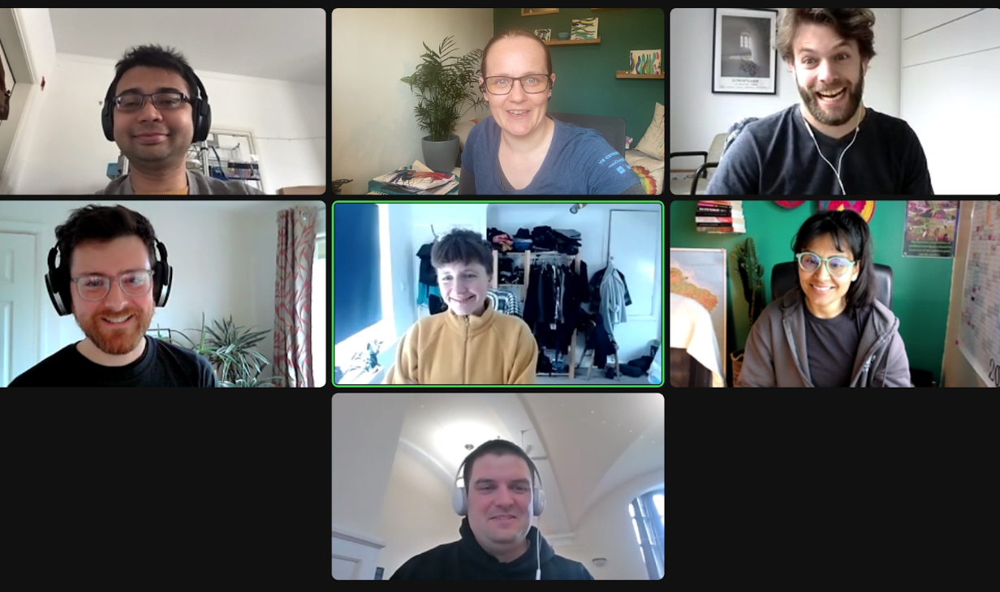

### CW22 - 2022-04-04

## **Collaborative Ideas session group: D-Dandelion**

#### **Participants**

* Abhishek Dasgupta, University of Oxford, abhishek.dasgupta@cs.ox.ac.uk
* David Wilby, University of Sheffield, d.wilby@sheffield.ac.uk
* Ben Krikler, U. of Bristol, / RemotleyGreen, [b.krikler@cern.ch](mailto:b.krikler@cern.ch) / ben@remotely.green 
* Nadine Spychala / University of Sussex / [N.Spychala@sussex.ac.uk](mailto:N.Spychala@sussex.ac.uk) 
* Yo Yehudi / Open Life Science / [yo@openlifesci.org](mailto:yo@openlifesci.org)
* Yadira Sanchez / U. of southampton / [y.sanchezbenitez@soton.ac.uk](mailto:y.sanchezbenitez@soton.ac.uk)
* Colin Sauze / Aberystwyth University / [cos@aber.ac.uk](mailto:cos@aber.ac.uk)

#### **Group photo**

---

#### **Collaborative Idea Title**

Interdisciplinary Researchers ‘R’ Us

#### **Context / Research Domain  **

#### A registrar for methods, tools, researchers (experts)

It involves “all” disciplines working towards a certain goal - so it could be any background of expertise looking to fill in the gaps, wanting to find if ideas have been developed, what tools have been used in that context, responding to the questions: what has been done and what are the gaps? 

Does the initial point of departure need to be a team of different disciplines working towards a shared goal? This collaborative platform where ppl can look up things is usable by single ppl, too (who might seek out information from another discipline for their own project)

#### **Problem**

Interdisciplinary RSEs and researchers **do not currently have an easy way to look up methods, tools and experts in the domain that they are working on**, of which they are not themselves an expert. This lack of knowledge often leads to re-inventing the wheel, and can impede effective collaboration. Using the incorrect tool or language can reduce the impact of the work as well.

In addition, speaking to people in different disciplines is hard. We **often don’t have a common set of words or understandings** of each other’s research domains. This can be made even worse when a word has a special meaning to researchers in a domain (and worse when it has a special meaning to both sides of the discussion). This can often lead to a failure to understand each other, even when we think we do. 

#### **Solution - Ben and David**

* Collaborative platform for contributions of cross-discipline 101-style guides, e.g. qualitative research for quantitative folks; ‘biology’ for everyone else etc.
    * Nicely indexed and searchable 
    * Awesome list subset (https://github.com/sindresorhus/awesome)
    * **Quality assurance: **Anyone can add but certain profiles with moderation capacity
    * **Quality assurance**: Catalogue of researchers with their expertise - managed by a curator
    * **Integration**: Cross linked to Orcid, github, linkedin

#### **Diagrams / Illustrations Nadine**

* A network where different disciplines (nodes) are linked to each other (via edges)
    * Edges might be “eased” via the collaborative platform

---

 **Licence**: These materials (unless otherwise specified) are available under the Creative Commons Attribution 4.0 Licence. Please see the [human-readable summary](https://www.google.com/url?q=https://creativecommons.org/licenses/by/4.0/&sa=D&source=editors&ust=1647284290073715&usg=AOvVaw2Hv6utgvyVwEcX-Mj6_3ms) of the CC BY 4.0 and the full [legal text](https://www.google.com/url?q=https://creativecommons.org/licenses/by/4.0/legalcode&sa=D&source=editors&ust=1647284290073913&usg=AOvVaw1dHZ8juvIBg5qXBnasVv35) for further information.

-----

BRAINSTORM OLD:

**Brainstorm:**

*  “RSEs like me” - interviews and profiles of interdisciplinary and non-traditional researchers who work near or with code. (Addressing the “I wasn’t sure where I fit” common theme we had!) -> it’s ok to 🫶have a wiggly career. 
* **🤩🤩🤩Interdisciplinary Project / challenge discovery: An easy way to find a potentially related tool / method / problem, from another discipline, and reduce “reinventing the wheel” within a discipline +1 YS (ahhh this sounds amazing—)**
    * **does such a thing exist already (else we might ourselves reinvent the wheel :P)? **
    * **something like [https://betalist.com/](https://betalist.com/) but for research projects**
    * **+1, would be really useful – I’m imagining something like a wiki, particularly around relevant tooling for particular disciplines – R and Python for example have quite different tooling to ensure best practices)**
*  Interdisciplinarity and creativity go hand in hand - how can we and is it possible to elaborate collective (also interdisciplinary) engaging methods of research - beyond the usual suspects - meaning involving art, CS, social sciences, philosophy , etc… 
*  Checklist for publishing research code sustainably - what to think about before you publish a paper with research code (e.g. where is your code? Is there a readme? Where’s the data? etc.) - maybe these exist in many forms and places already! (https://the-turing-way.netlify.app/reproducible-research/reproducible-research.html e.g.)
* ** 🤩🤩 How to speak with people from different core disciplines (from the perspective of someone interdisciplinary)? How to sensitize others for possible gaps of knowledge/how to sensitize oneself to be aware of gaps of knowledge others might have? How to establish a common language? (Going top-down?)**
    * +1 a series of guides - biology 101 for computer scientists or qual 101 for quant ppl. +1 Yes, I think something like that would be great!