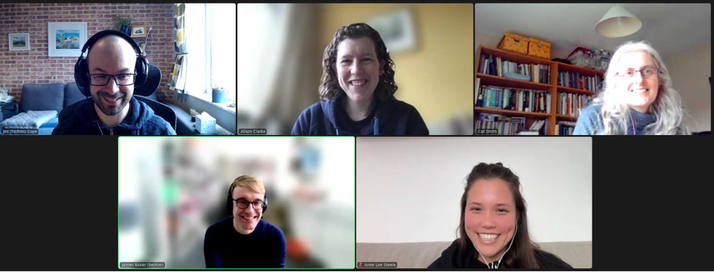

### CW22 - 2022-04-04

## **Collaborative Ideas session group: B-Bamboo**

#### **Participants**

* Alison Clarke, Durham University, [alison.r.clarke@durham.ac.uk](mailto:alison.r.clarke@durham.ac.uk)
* Catherine Smith, University of Birmingham, [c.j.smith@bham.ac.uk](mailto:c.j.smith@bham.ac.uk)
* James Baker, University of Southampton [j.w.baker@soton.ac.uk](mailto:j.w.baker@soton.ac.uk)
* Anne Lee Steele, Alan Turing Institute, [asteele@turing.ac.uk](mailto:asteele@turing.ac.uk) 
* Jez Cope, The British Library, [jez.cope@bl.uk](mailto:jez.cope@bl.uk) 

#### **Group photo**

---

#### **Collaborative Idea Title**

Interdisciplinary Glossary of Glossaries

#### **Context / Research Domain**

Interdisciplinary; spaces where disciplines come together (e.g. through computational methods/tools/projects)

#### **Problem**

The same terms are often used in different ways by different groups and different terms can also be used for the same concept. This can be particularly relevant across domains, especially between those in the humanities and those in technical roles. Even terms such as data or database can mean very different things in different disciplines. 

#### **Solution**

A lot of resources already exist which define terms, but these can be domain specific.

The aim is to produce a tool that combines multiple (ideally live) glossaries, to show where definitions (rather than terms) overlap/intersect and where they speak across each other. The tool could include visualization, perhaps in a network showing similar terms, perhaps along the lines of: 

* [https://opensyllabus.org/](https://opensyllabus.org/) 

* [https://seealso.org/](https://seealso.org/)   

A toolkit (maybe like those at [https://themuseumsai.network/toolkit](https://themuseumsai.network/toolkit/)) could be built on top of these resources to encourage conversations at the beginning of a project to help establish the vocabulary usage for the particular project, maybe by making their own shared glossary from the resources already available which can be developed through the project. In some projects this will also need to be multilingual.

#### **Diagrams / Illustrations**

 showing the sort of network map that could be produced for different terms.](../images/cw22-explore-the-graph.png )

_Screenshot from [https://opensyllabus.org](https://opensyllabus.org) showing the sort of network map that could be produced for different terms._

#### Glossaries

* _[Glossary of digital humanities terms - Folgerpedia](https://folgerpedia.folger.edu/Glossary_of_digital_humanities_terms) (en)_
* _[RSE Glossary](https://rseng.github.io/rse-glossary/) (en)_
* _[Glossary — The Turing Way](https://the-turing-way.netlify.app/afterword/glossary.html) (en)_
* _[Data Science Glossary ](https://www.datascienceglossary.org/)(en)_
* _[Dataquest data science terms](https://www.dataquest.io/blog/data-science-glossary/) (en)_
* _[Turing Institute AI/ML glossary](https://www.turing.ac.uk/news/data-science-and-ai-glossary) (en)_
* _[Carpentries 'Glossario' glossary (R/Python package)](https://glosario.carpentries.org/) (multi)_
* _[A to Z of AI (has general terms)](https://atozofai.withgoogle.com/) (en)_
* _[Mozilla developer glossary](https://developer.mozilla.org/en-US/docs/Glossary) (en)_
* _[Centre for humanitarian data](https://centre.humdata.org/glossary/) (en)_
* _[Open data handbook glossary](https://opendatahandbook.org/glossary/) (multi)_
* _[Research data management glossary](https://casrai.org/rdm-glossary/) (en)_
* _[Oxford research data glossary](https://researchdata.ox.ac.uk/home/glossary/) (en)_
* _[CASRAI](https://casrai.org/rdm-glossary/) (en)_
* _[Research data Oxford](https://researchdata.ox.ac.uk/home/glossary/) (en)_

#### Toolkits

* [Museumsai toolkit](https://themuseumsai.network/toolkit)
* [Bad Design Toolkit](https://drive.google.com/file/d/1zVfrQqS1cLrmqn12-rQXzYbNcbBPWIfL/view?usp=sharing) and [Bad Design Canvas](https://drive.google.com/file/d/1p1PL066R_zvW9KAve5I2O9L0cYvEDeMP/view?usp=sharing)
* [Becoming ‘RAD’](https://www.theengineroom.org/wp-content/uploads/2021/06/RAD-Tip-Sheets.pdf)

---

 **Licence**: These materials (unless otherwise specified) are available under the Creative Commons Attribution 4.0 Licence. Please see the [human-readable summary](https://www.google.com/url?q=https://creativecommons.org/licenses/by/4.0/&sa=D&source=editors&ust=1647284166745789&usg=AOvVaw0h_0yYDB0wx39MKDqMgFt7) of the CC BY 4.0 and the full [legal text](https://www.google.com/url?q=https://creativecommons.org/licenses/by/4.0/legalcode&sa=D&source=editors&ust=1647284166746021&usg=AOvVaw1iUxphVu6l-q2DsVMRgP6t) for further information.

