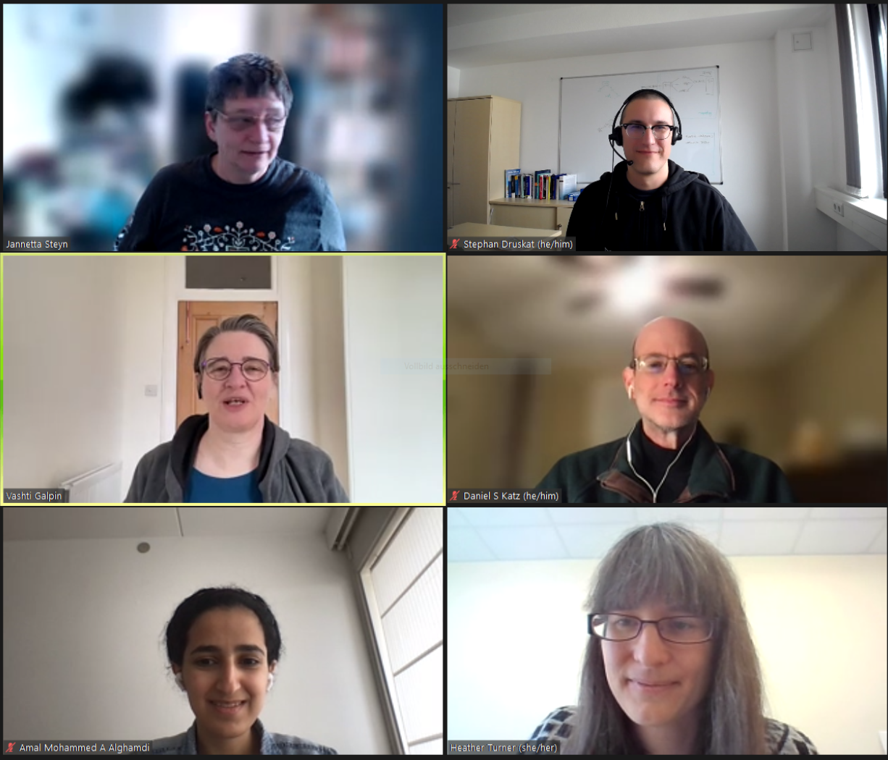
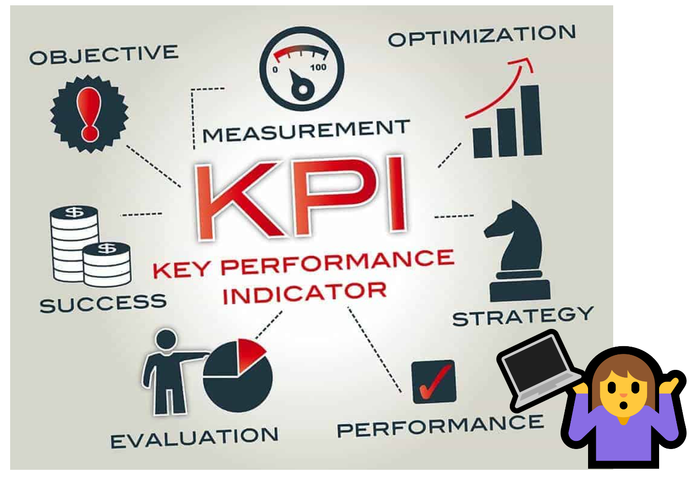

### CW22 - 2022-04-04

## **Collaborative Ideas session group: F-Fern**

#### **Participants**

* Stephan Druskat, German Aerospace Center (DLR), [stephan.druskat@dlr.de](mailto:stephan.druskat@dlr.de) 
* Daniel S. Katz, University of Illinois at Urbana-Champaign, [d.katz@ieee.org](mailto:d.katz@ieee.org)
* Heather Turner, University of Warwick, [h.turner.1@warwick.ac.uk](mailto:h.turner.1@warwick.ac.uk) 
* Vashti Galpin, University of Edinburgh, [Vashti.Galpin@ed.ac.uk](mailto:Vashti.Galpin@ed.ac.uk)
* Amal Alghamdi, DTU, [amaal@dtu.dk](mailto:amaal@dtu.dk)  
* Jannetta Steyn, Newcastle University, jannetta.steyn@newcastle.ac.uk

#### **Group photo**

---

#### **Collaborative Idea Title**

Key Performance Indicators for Research Software Engineering Output

#### **Context / Research Domain**

Software Sustainability

#### **Problem (Stephan)**

Key [Performance Indicators](https://en.wikipedia.org/wiki/Performance_indicator) (KPIs) are used in research evaluation to determine the grade of success of a researcher, research project, research group, or research process. They may be part of decisions around funding allocation, (re-)organisation and the establishment of new units within a single institution or beyond (e.g., an association of research centres such as the [Helmholtz Association](https://www.helmholtz.de/en/) in Germany).

Established KPIs often include metrics like the number of peer-reviewed publications accepted or published in journals or at conferences (where sometimes the “quality” of the conference also plays a role, e.g., [in computer science](https://www.core.edu.au/conference-portal)). For software and software work, it is often hard to come up with similar “objective” metrics. This is partly due to the way software is created - often in a continuous process without a fixed endpoint - but also the way it is (or isn’t) being published in a traceable manner. This leads to a situation where the work and outputs of research software engineers (RSEs) are hard to assess and measure. This, in turn, leads to disadvantages for individual RSEs as well as groups or departments that primarily produce software or software-related outputs (such as training, documentation, consultation), for which established KPIs simply don’t work.

As part of the ongoing realisation that software is an important - and in fact integral - part of modern research, KPIs should be established that can be used to assess, evaluate and finally, better value the work and outputs of research software engineering. At the same time, these indicators should reflect the valid criticism directed at similar efforts, e.g., the h-index, as far as possible, and clearly document what they can and cannot measure, and what the threats to their validity are.

#### **Solution**

* Identify what the potential key indicators could be for research software engineering output.
* These could include measuring the contribution of an individual to a specific software project – we want to capture and value contributions that are tracked in open source systems such as
    * commits in GitHub of code, documentation, etc
    * PR reviews, 
    * adding comments to issues, 
    * closing issues.
* For the activities captured by Git, one could build scripts that parse repo history and extract/assemble data
* For the activities that can’t be directly captured by Git (for example, design that happens on a whiteboard, code review, user support, dissemination), one could build a bot that helps this tracking via commands in GitHub - CreditBot? TrackerBot?
* There is the need for a KPI that is equivalent to the h-index indicator to evaluate academic performance of RSE – hiring committees in academia take KPI indicators into account
    * At the same time, there is valid criticism directed at these kinds of indices and the perceived objectivity of metrics in general, we need to think about gaming threats, objectivity, and what metrics more generally can and cannot express objectively
* Indicators can look into how the software impact propagate: what is the research that cite the software tool and what is its impact  
* Whether the software has a testing framework can be taken into account and what is the test coverage, as well as other open source quality, health and DEI metrics (as developed by the [CHAOSS community](https://chaoss.community/) for example).
* Consider other ways to assess research output such as the Hidden REF [https://hidden-ref.org/](https://hidden-ref.org/)

#### **Diagrams / Illustrations**

_[https://www.citadel-h2020.eu/news/citadel-key-performance-indicator-toolbox-calculating-kpis-using-linked-open-data](https://www.citadel-h2020.eu/news/citadel-key-performance-indicator-toolbox-calculating-kpis-using-linked-open-data)_

_[https://hidden-ref.org/](https://hidden-ref.org/)_

---

 **Licence**: These materials (unless otherwise specified) are available under the Creative Commons Attribution 4.0 Licence. Please see the [human-readable summary](https://www.google.com/url?q=https://creativecommons.org/licenses/by/4.0/&sa=D&source=editors&ust=1647284345256808&usg=AOvVaw2Yzmfsc7GQsZTQD8o_l1gT) of the CC BY 4.0 and the full [legal text](https://www.google.com/url?q=https://creativecommons.org/licenses/by/4.0/legalcode&sa=D&source=editors&ust=1647284345257128&usg=AOvVaw3fwy3n3wxTZRft2VZZhagX) for further information.
