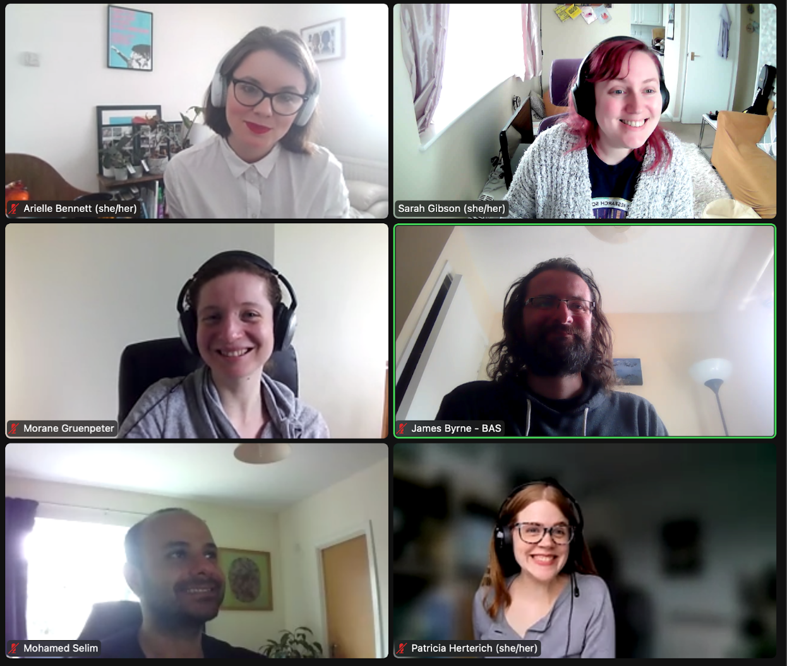
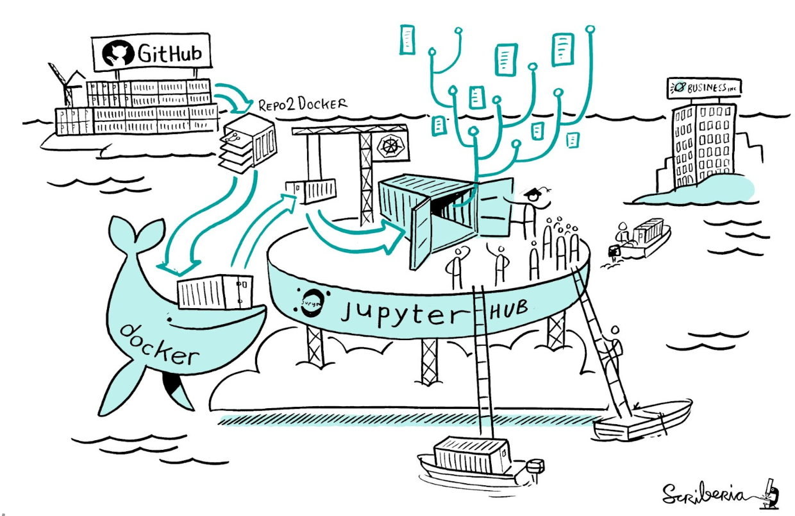

### CW22 - 2022-04-04

## **Collaborative Ideas session group: G-Ginkgo**

#### **Participants**

* Sarah Gibson, 2i2c, sgibson@2i2c.org
* Arielle Bennett, The Alan Turing Institute
* Morane Gruenpeter, [Software Heritage](https://archive.softwareheritage.org/), morane@softwareheritage.org
* James Byrne, RSE @ British Antarctic Survey, jambyr@bas.ac.uk
* Mohamed Selim, Project Leader, EMBL-EBI, mselim@ebi.ac.uk
* Patricia Herterich, DCC, University of Edinburgh, p.herterich@ed.ac.uk

#### Some ideas/challenges:

* Running open infrastructure requires skills that are really hard to learn and most PIs (senior people) do not understand/care about it
* Avoiding vendor lock in 
* People don’t mind paying for this (but do they care if it’s open?)
* Information management/sharing of assets is another level of infrastructure to consider, as much about people than systems
* Governance is also to be considered, so processes around this need to be transparent - community involvement/caring about people’s involvement
* Building on legacy work - creates technical and policy issues
* Guidance
* Framework 

#### **Group photo**

---

#### **Collaborative Idea Title**

Path to Open Platforms - new chapter for the Turing Way

#### **Context / Research Domain**

The governance, infrastructure assets and what is hosted asset (software, data, information) across all domains need a low barrier to development for research projects. Organisations exist to take this pain away, but teams might not always be able to employ these skills themselves and are unsure which options are the most suitable to choose.

#### **Problem**

Better efforts are needed to ensure there is easily accessible guidance for teams choosing open infrastructure solutions to underpin their research, that is not onerous for multidisciplinary researchers and engineers to adopt.

#### **Solution**

Create a decision making framework for PIs to pick open infrastructure to use. Pros and cons against commercially available solutions/infrastructure.

Initial work:

1. Literature review of any guides out there
2. Add guides helping research teams to share their software assets, infrastructure blueprints and data sets.
3. Summarize it as a chapter in the Turing Way

Further milestone:

4. Create a interactive website to make this a tool for researchers to use
5. Spread the word: work with funders to promote the resource in their guidance and potentially even add this to grant assessment criteria
6. Develop communication plan to disseminate 

#### **Diagrams / Illustrations**

A BinderHub as an example of an open infrastructure system. Many open tools synchronized together.

_References:_

1. Scholarly infrastructures for research software  Report from the EOSC Executive Board Working Group (WG) Architecture Task Force (TF) SIRS _[http://dx.doi.org/10.2777/28598](http://dx.doi.org/10.2777/28598)_
2. D2.7 Framework for assessing FAIR Services (V1.0_DRAFT). Zenodo. https://doi.org/10.5281/zenodo.5336234
3. Reproducible Environments - _The Turing Way _https://the-turing-way.netlify.app/reproducible-research/renv.html

---

 **Licence**: These materials (unless otherwise specified) are available under the Creative Commons Attribution 4.0 Licence. Please see the [human-readable summary](https://www.google.com/url?q=https://creativecommons.org/licenses/by/4.0/&sa=D&source=editors&ust=1647284370432093&usg=AOvVaw2IyqAL186hk_ruENZiM2-A) of the CC BY 4.0 and the full [legal text](https://www.google.com/url?q=https://creativecommons.org/licenses/by/4.0/legalcode&sa=D&source=editors&ust=1647284370432262&usg=AOvVaw2R4BnNUMy5SZKiFCW1z4Ky) for further information.
