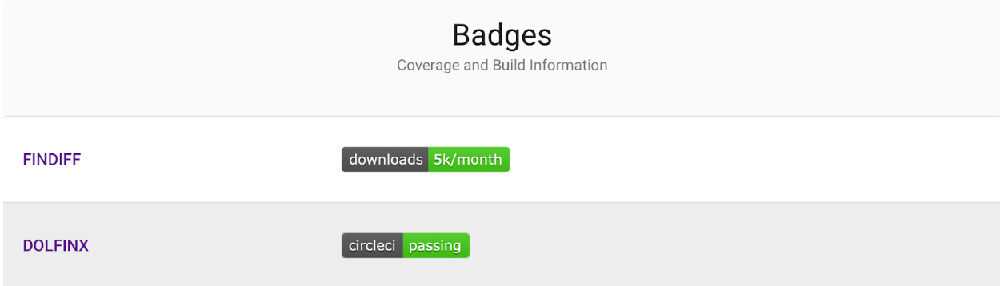

### CW22 - 2022-04-04

#### **Hack Day Idea proposer**

Stephan Druskat

---

#### **Hack Day Idea title (provisional)**

**RESPIRATOR** (_Research Software Performance Indicators Really Acknowledging The Objective Reality_) - Breathing life into key performance indicators for research software engineering work that evaluators can understand

#### **Context and/or research domain**

This applies to all domains, institutions, managers, funders, etc. who still rely on outdated metrics and KPIs that don’t reflect the reality of computer-based research.

#### **Problem**

The Objective Reality is that research software plays a crucial role in research today. The people behind this are research software engineers (RSEs), without whose output research pretty much wouldn’t be possible. They may not write an awful lot of papers, but they design, create and maintain the software that is needed to do research. They also write documentation, run services, train researchers in computational methods, and consult with research projects. Sometimes they also help you with your printer.

Come evaluation time, though, they are faced with the fact that hardly none of that work shows up in the reports, metrics compilations, etc., that are used to evaluate the success of the research that has been done in a given project, group, institution, or even by themselves as individuals. See the [HiddenREF](https://hidden-ref.org/)! This is because the key performance indicators (KPIs) used to evaluate research are often still based on peer-reviewed text publications in journals or conference proceedings.

#### **Solution**

Key performance indicators (KPIs) for research software engineering work would help those who evaluate research greatly in appreciating and rewarding those who do the work, in a way that they are used to and understand well.

##### Key performance indicators

A minimum viable output of this hack effort would therefore include:

* A proposal for a set of key performance indicators that
    1. can be applied to research software engineering work largely independently from research domains;
    2. can be retrieved for all levels of evaluation: individual, project, group, department, institution, organization, etc.;
    3. reflect the Objective Reality, i.e., the real-world processes that are applied in research software engineering work, be it in: open/inner/closed source software development including design, documentation, testing, code review, release engineering, maintenance, service provision, consulting, training, public relations and outreach, building and managing communities, etc.

Metrics are hard to do, and easy to get wrong, and so such a proposal should clearly identify when, how, and to whose work they can and cannot be applied, and on what level.

The proposal will be made publicly available for review, either as a text document of some sort, or on a website. Relevant communities (first on the research software side, e.g., RSE initiatives, ReSA, HiddenREF, then on the evaluation side, e.g., funders, organizations, policy groups) will be actively invited to review the work and collaborate on their optimization.

##### Tooling

As a bonus, once we have figured out the MVP, we will start building tooling for one of the newly proposed KPIs to demonstrate that they can be made actionable, and that we can provide evaluators with tools that retrieve and [demystify](https://www.youtube.com/watch?v=m8w14IaS8Us) the magic numbers for them. ~~Excel macros~~ publication and source code repository mining anyone? There are some [available tools](https://livablesoftware.com/tools-mine-analyze-github-git-software-data/) to mine and analyze git repositories, such as [gitcompare](https://gitcompare.com) we could build on.

**Useful, but not required, skills/experience** for this hack could include 

* interest in or experience with the evaluation of research
* interest in or experience with metrics (and their reproducibility and evaluation)
* interest in or experience with software as a research output
* interest in or experience with research software engineering practice
* interest in or experience with improving the way research is evaluated

Notes (Amal):

Some software for comparing repository info 

* Tools survey [https://livablesoftware.com/tools-mine-analyze-github-git-software-data/](https://livablesoftware.com/tools-mine-analyze-github-git-software-data/)
* [https://gitcompare.com](https://gitcompare.com) (e.g. compare packages DOLFINX and FINDIFF)

#### **Diagrams / illustrations**

RSERESpirator, a cheeky adaptation of [Tania Allard](https://twitter.com/ixek)’s great logo for the [RSE conference 2019 in Birmingham](https://society-rse.org/events/rse19/). Used under fair use (I sincerely hope).

---

 **Licence**: These materials (unless otherwise specified) are available under the Creative Commons Attribution 4.0 Licence. Please see the [human-readable summary](https://www.google.com/url?q=https://creativecommons.org/licenses/by/4.0/&sa=D&source=editors&ust=1647286678906940&usg=AOvVaw0vSks1DtfPR7W_YyAHXwVE) of the CC BY 4.0 and the full [legal text](https://www.google.com/url?q=https://creativecommons.org/licenses/by/4.0/legalcode&sa=D&source=editors&ust=1647286678907165&usg=AOvVaw33BNzteCNFZ6dXgMZewRUN) for further information.

NOTES

* SSI Checklist
