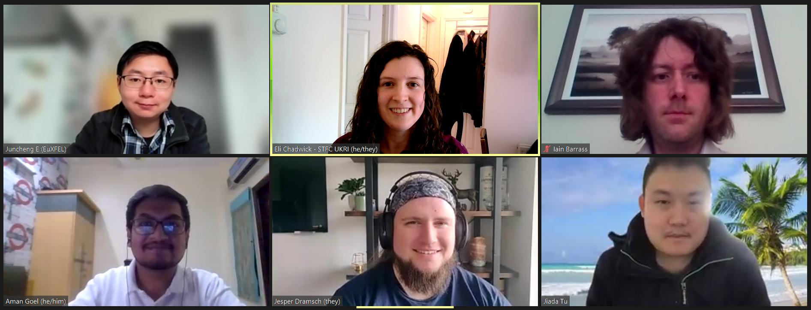
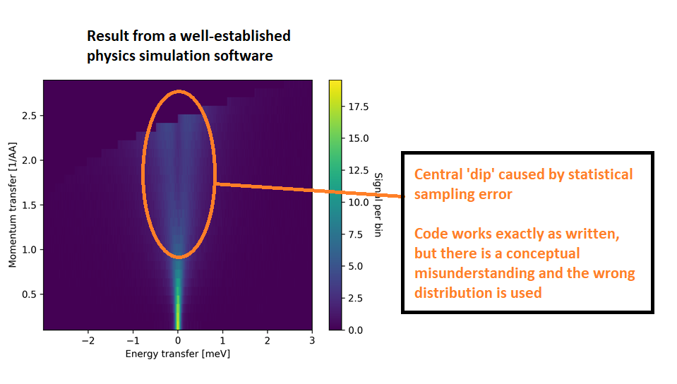
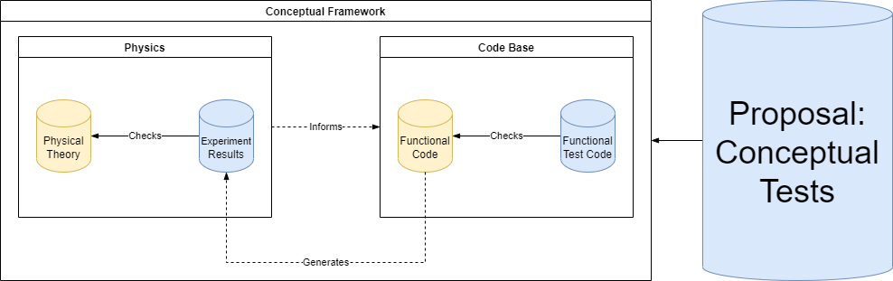

### CW22 - 2022-04-04

# Collaborative Ideas session group: C-Clover

**Participants**

* Aman Goel, University of Delhi, [aman.goel185@gmail.com](mailto:aman.goel185@gmail.com)
* Juncheng E, European XFEL, [juncheng.e@xfel.eu](mailto:juncheng.e@xfel.eu)
* Iain Barrass, Queen Mary University of London, [i.barrass@qmul.ac.uk](mailto:i.barrass@qmul.ac.uk)
* Jesper Dramsch, ECMWF, [jesper@dramsch.net](mailto:jesper@dramsch.net)
* Eli Chadwick, STFC, [eli.chadwick@stfc.ac.uk](mailto:eli.chadwick@stfc.ac.uk)
* Jiada Tu, Durham University, [jiada.tu@durham.ac.uk](mailto:jiada.tu@durham.ac.uk)

### Group photo

------

### Collaborative Idea Title

Squashing conceptual bugs when computational bugs have been exterminated

### Context / Research Domain

In physics the theory behind the code is as complex as writing the code itself. Taking over code-bases and understanding the in-depth theory, as well as, understanding the simulation code is an almost impossible undertaking. Finding errors and bugs in that code-base should be easier to enable sustainability of codebases and facilitate collaboration and ensure correct results from the computation.

### Problem

The computational ones can be captured by the machine itself, but it’s difficult to track and work on logical & conceptual bugs. Conceptual bugs are particuarly difficult to find individually, when the code was written in the same mindset that the theory was derived and the tests were implemented.

**Example 1:** Logical Errors - The code executes well but doesn’t give the desired results.
**Example 2:** Statistical Errors - The sampling works but should have sampled from a different source (see Illustration section)

### Solution

* Automated Tests and Property-based Testing (*Example: [Hypothesis](https://hypothesis.readthedocs.io/en/latest/)*)
* Code Review & Pair Programming to break conceptual lock-in (*Examples: [The Turing Way Code Reviewing Process](https://the-turing-way.netlify.app/reproducible-research/reviewing.html), [SSI’s Online sustainability evaluation](https://www.software.ac.uk/resources/online-sustainability-evaluation)*)
* Documentation that includes the physics framework rather than expecting people to read research papers (*Example: [Astropy](https://docs.astropy.org/en/stable/cosmology/index.html)*)
* Sample input data which should produce a known/well-established result
* Sample experimental output to compare computational result to (where possible)
* Establish acceptable error rates for computational results to deviate from reference data
* Standard Developer Guidelines (*Example: [Scikit-HEP Developer Information](https://scikit-hep.org/developer)*)
* Accessible Community for discusssion (*Example: [Scikit-HEP’s Getting in touch](https://scikit-hep.org/getting-in-touch)*)
* Culture shift!

The actual *solution* might be a standardised framework/guide similar to [The Turing Way](https://the-turing-way.netlify.app/welcome.html) or epanding on it. However, rather than a tool, it could be helpful to have some good practices and community conversations around practices to reduce the gap between the conceptual/logical errors and their resolution.

### Diagrams / Illustrations

#### Example of Conceptual Errors

*The sampling works but should have sampled from a different source [CC-BY Eli Chadwick]*

#### Diagram of Proposed Solution

*Diagram of Conceptual Framework encompassing Physics and Codebase with interactions [CC-BY Jesper Dramsch]*

------

 **Licence:** These materials (unless otherwise specified) are available under the Creative Commons Attribution 4.0 Licence. Please see the [human-readable summary](https://creativecommons.org/licenses/by/4.0/) of the CC BY 4.0 and the full [legal text](https://creativecommons.org/licenses/by/4.0/legalcode) for further information.

------

### Discussion Notes:

**Eli**: Interacts with biology (e.g. `bioconda`) and wonders how we can integrate this into physics eco-system. Uses infrastructure to deploy to “Galaxy” and therefore has to use `conda`. 
**Jiada**: Uses different software packager to include more software than just conda. 

**Juncheng**: Different project proposal about compatibility of complex software dependencies. Problem is that small groups don’t have enough resources to take on the scale of this problem. They want to use differents software features together, but this is difficult to achieve, since different softwares have different dependencies. 
**Jiada**: How do you put them together? 
**Juncheng**: They create different environments for the softwares but combining them is impossible. 
**Eli**: Has used containers for getting a single environment to work but not to resolve dependencies. 
**Jiada**: Different containers for different dependencies wastes resources in the communication of these containers. 

**Jiada**: Does anyone know how to guarantee code quality? 
**Aman**: Two ways:

1. Code Reviews
2. Developer Standards

CI/CD pipelines to check for code.

* Type checking
* Tests
* Formatting

**Jiada**: How do you balance code quality and time? Writing tests wastes a lot of time, so how do you make sure the development is still efficient?

**Aman**: Use Pytest and Hypothesis for testing and automation.

**Jesper**: Hypothesis is great for property-based testing. Start with minimal tests don’t over-write tests, essentially re-creating a Waterfall method at that point and having to discard half their test cases realizing something different was needed. Add more tests as needed.

**Eli**: Developer left, he wrote most of the code and has the physics knowledge. Eli knows some but not all in-depth. He now has to maintain the code, being the only one left on the project.

**Aman**: Write good documentation, use questions to inform additions to documentation. Docstrings are great. Accessibility issues with just asking and not documenting. Also great if the developers are directly accessible (and have the bandwidth to help) via open communication community channels like GitHub, Gitter etc.

// General discussion about possible topic.

**Eli**: How do test for conceptual bugs over just code bugs?

**Aman**: Very difficult to catch these errors.

