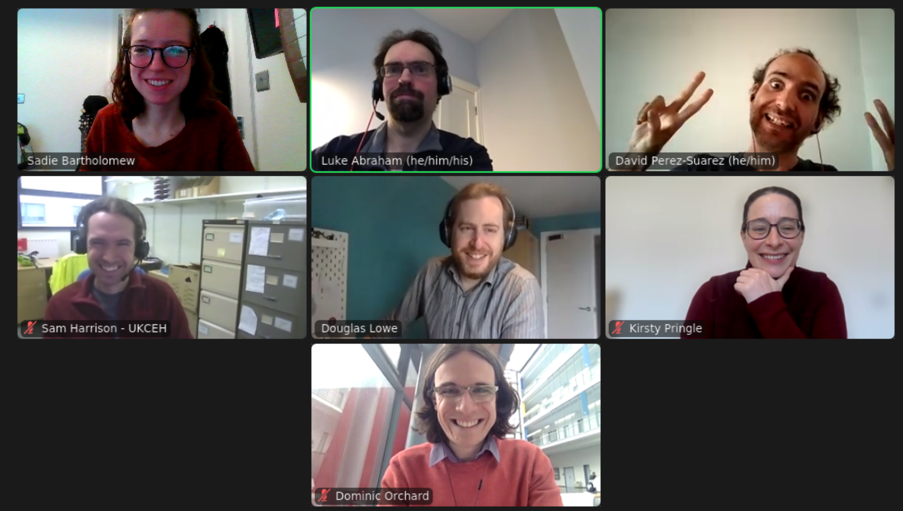
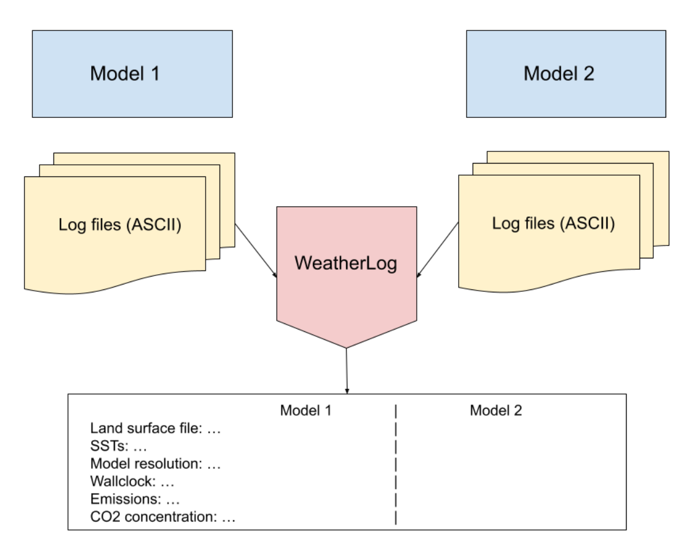

### CW22 - 2022-04-04

## **Collaborative Ideas session group: E-Evergreen**

#### **Participants**

* _Luke Abraham, NCAS & University of Cambridge, n.luke.abraham@ncas.ac.uk_
* _Sam Harrison, UK Centre for Ecology & Hydrology, sharrison@ceh.ac.uk_
* _Sadie Bartholomew, University of Reading & NCAS, sadie.bartholomew@ncas.ac.uk_
* _David Pérez-Suárez, UCL, [d.perez-suaerz@ucl.ac.uk](mailto:d.perez-suaerz@ucl.ac.uk)_
* _Douglas Lowe, UoM, douglas.lowe@manchester.ac.uk_
* _Kirsty Pringle, SSI University of Edinburgh, k.pringle@epcc.ed.ac.uk_
* _Dominic Orchard, ICCS at University of Cambridge and University of Kent, d.a.orchard@kent.ac.uk_

##### IDEAS

* MetOffice model and make an unified model. OS licence, and coupled with many other models. Without the reputation of old models, that seem different to use. How to help engage people using it.
* Training users to run the models, hard to use and how easy to set them wrong.
    * Luke has a VM, documentation, python tools, that is actively working on (as fun).
        * Maybe migrate it from vbox to vmware as more secure, it runs on AWS (have to pay)
* Bioexcel project - supporting workflows (common workflow language), that works with containers, conda envs, ... You provide a tool descriptor, that the runner can run the tool.
    * Was easier to run jobs on ARCHER.
    * Silk is another tool that seems nice. (It's python 2.7, a new version is coming up)
    * Rose, a tool to use with Cycl, a configuration manager. Many parameters that need to be setup.
* Workflow managers that could be used to feed into publications. To help reproducibility.
    * [Workflowhub.eu](https://workflowhub.eu/) a repository where you can put workflows, doi, linked with github repositories... 
    * How to keep the provenance also in place? [RO-Crate](https://www.researchobject.org/ro-crate/)) converts to json, but it's still in development space.Cambridge had some work in this space too: [The cambridge project Fresco](https://www.cl.cam.ac.uk/research/dtg/fresco/)
* There are multiple abstraction layers, on top of each other, where the variables are used.
* How easy is to run it and run the tests?  CMake, documentation, put tests as gh actions.
    * Porting code and jobs between supercomputers. How can you put a single version to run a particular model without having to set a directory with TBs with all the models.
* Guidelines to help set things up - infrastructure to think about things.
* Is there a way quick and easy to obtain the information, env variables, where they point to, etc... We are reading from these places. Logs are big, and ignored (unless they fail).
    * As training: what are the good practices, where to look for details, ...
    * Different type of logs for different models.
* Checking the configuration - as an education step.
* There are many models, languages. Something generic will be better. But starting small and show potential could be a good starting point.
    * Logs need to be filtered, to find something.
    * Logs diffs, to compare outputs
    * Logs parser, something that could extract the important bits.
* Tool to extract the "information" that you should be reporting (as good practices). E.g., obtain the machine, and some other information. 
* Something to prototype to record a set of information. Extract a json file that records validation tests, what model is run, ... - and then the tool could check whether the tool is following the right standard.
    * A standard could be defined to extract some model information. If it's in the log, it can be used to interact while it's running.
    * Logging libraries has standards, like time, and levels (e.g., https://github.com/cmacmackin/flogging). Maybe we are looking to validation tests that could help to diffs.
* A layer on top of the logs to filter.
    * Helps to monitor the logs
    * Obtain important information
    * Provides a way for reproducibility

#### **Group photo**

---

#### **Collaborative Idea Title**

**Weather Log**

#### **Context / Research Domain**

Weather and climate science was our specific domain in mind, but our solution may be applicable generically for any domain which runs models which require complex or many-faceted configuration.

#### **Problem**

Configuring a model run (both the inputs and the workflow setup) in weather and climate is very complicated and involves many layers of abstraction, locations of field etc. storing configuration variables and workflow task settings, etc. It also varies widely depending on specific model type and context. This can be daunting for the user to set up and can easily lead to mis-configuration such that the user can often realise only mid-run or post-run that the model was not run with the correct configuration and therefore needs to be re-run.

#### **Solution**

Defining a standard for log outputs, for tools to follow for checking that simulations are running correctly. This will provide a means for researchers to check key metrics during simulations, to ensure these are sensible (rather than waiting until the end of the simulation). It will consist of a standard flag for log systems to use, to identify the information being checked, standards for recording the information to be checked (which can be passed in with the input files at the beginning of the process), and a standard for reporting the results of these checks during/after the simulation is run. This allows for users of these models to confirm the inputs and configurations used for comparison with other set-ups.

**Diagrams / Illustrations**

_Example usage comparing output from 2 models. Could also be used to monitor a single model at runtime._

---

 **Licence**: These materials (unless otherwise specified) are available under the Creative Commons Attribution 4.0 Licence. Please see the [human-readable summary](https://www.google.com/url?q=https://creativecommons.org/licenses/by/4.0/&sa=D&source=editors&ust=1647284315335286&usg=AOvVaw2N3pJf84_cD1qeGJSyVBxq) of the CC BY 4.0 and the full [legal text](https://www.google.com/url?q=https://creativecommons.org/licenses/by/4.0/legalcode&sa=D&source=editors&ust=1647284315335437&usg=AOvVaw3AxJnftOLQt3e9AVhJB3Ah) for further information.
